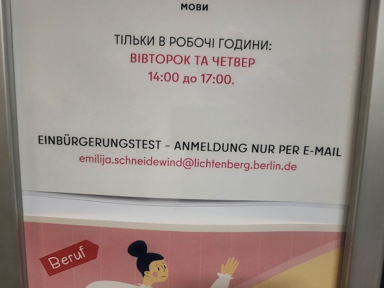
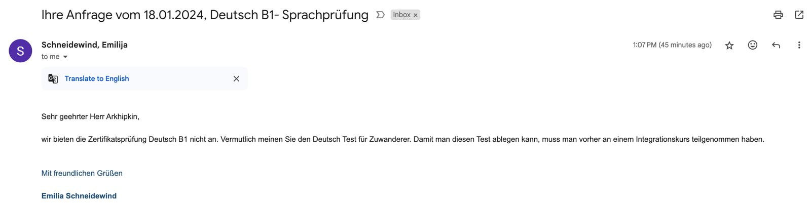
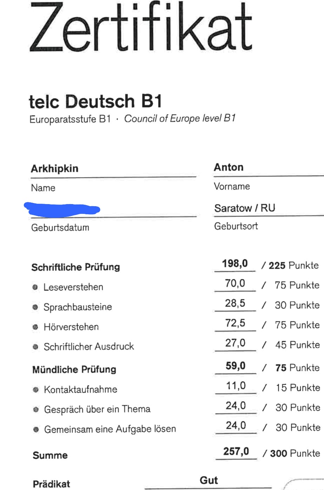
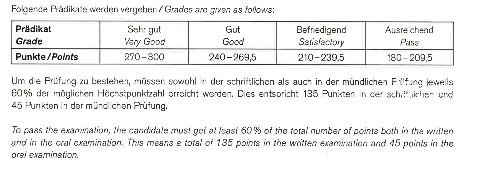

# In progress: подготовка документов на получение немецкого гражданства (январь 2024 - ...)

<a name="content"/>

## Содержание  
- ### [Вводные данные](#input)  
- ### [Необходимые документы](#prerequisites)  
  - ##### [Regeln die Menschen in Deutschland zusammenleben](#regeln_leben)  
  - ##### [Deutschkenntnisse mindestens auf der Stufe B1](#b1)  
- ### [Наши действия по шагам](#actions)  
  - ##### [1. Консультация/запись в VHS](#vhs)  
  - ##### [2. Einbürgerungstest](#einbuergerungstest)  
  - ##### [3. Deutschkenntnisse mindestens auf der Stufe B1](#b1_test)  
  - ##### [4. Остальные документы](#rest_documents)  
  - ##### [5. Подача заявлений на гражданство](#application)  

<a name="input"/>

### Вводные данные:
- мы живем в Германии с конца 2015 года
- у меня и жены уже есть ПМЖ (Unbefristete Niederlassungserlaubnis), но нет сертификатов о сдаче немецкого B1 🙃
- у детей (8 и 5 лет) есть долгосрочные ВНЖ
- на данный момент в LEA подано заявок на пару лет их последующей обработки
- уже с год "принимают" закон, разрешающий будет получать двойное немецкое гражданство, не отказываясь при этом от российского. На данный момент вроде как осталось совсем чуть-чуть, после принятия этого закона ожидается очередной прилив заявок. 

Учитывая всё вышеописанное, есть смысл начать подготавливать документы 🙂
Отсюда и начинаем нашу историю.

 <a href="#content"> К содержанию </a> 

<a name="prerequisites"/>

### Необходимые документы
Не так давно появилась онлайн форма для подачи документов на [Einbürgerung - Verleihung der deutschen Staatsangehörigkeit beantragen](https://service.berlin.de/dienstleistung/318998/).

Из того, что сразу бросается глаза, нам необходимо начать со следующих пунктов:
- Sie sprechen Deutsch: Sie haben Deutschkenntnisse mindestens auf der Stufe B1.
- Sie wissen, nach welchen Regeln die Menschen in Deutschland zusammenleben. Dies können Sie nachweisen durch: bestandenen Einbürgerungstest oder das Zertifikat „Leben in Deutschland“ [ссылка](https://www.berlin.de/vhs/volkshochschulen/reinickendorf/kurse/deutsch/artikel.1058429.php)

Вроде и на то, и на другое записываться можно в одном из филиалов [VHS (Die Berliner Volkshohschulen)](https://www.berlin.de/vhs/volkshochschulen/)

Помимо этого, из того, что я слышал - может быть еще проблема со свидетельством о рождении: наши советские зеленые/серые книжечки сейчас вроде как не канают.
Так что начать так же можно с записи в российское консульство, чтоб получить свидетельства о рождении нового образца с апостилем (услуга вроде называется "Истребование документов из России")

 <a href="#content"> К содержанию </a> 

<a name="regeln_leben"/>

#### Regeln die Menschen in Deutschland zusammenleben
Как описано выше, есть [2 опции](https://www.berlin.de/vhs/volkshochschulen/reinickendorf/kurse/deutsch/artikel.1058429.php):
- Einbürgerungstest - процесс достаточно подробно описан в [этом телеграм посте](https://t.me/howtoberlin/583)
- Zertifikat „Leben in Deutschland“ - по слухам, он несколько проще (хотя не думаю, что и первый вариант будет сильно сложнее) [Aktuelle Termine Leben in Deutschland](https://www.vhsit.berlin.de/VHSKURSE/BusinessPages/CourseSearch.aspx)

 <a href="#content"> К содержанию </a> 

<a name="b1"/>

#### Deutschkenntnisse mindestens auf der Stufe B1
Есть разные варианты экзаменов для подтверждения знания B1 (https://www.berlin.de/vhs/kurse/deutsch-integration/beratung/):
- **Deutsch-Test für Zuwanderer (DTZ)**: вроде как самый простой, но пока не особо понятно, как на него записаться (кое-где пишут, что он только для тех кто прошел интеграционные курсы). Anmeldungen zum Deutsch-Test für Zuwanderer (DTZ) sind nur bei den Beratungsstellen der Volkshochschulen möglich
  - https://www.gast.de/de/forschung-entwicklung/entwicklung/auftraege/deutsch-test-fuer-zuwanderer-dtz
- **telc**: по случам, `чуток попроще каких-то других форм` (c) 😁 Процесс достаточно подробно описан в [этом телеграм посте](https://t.me/howtoberlin/527), запись на экзамен - по [ссылке](https://www.humboldt-institut.org/en/german-courses/exams/)
- **Goethe Zertifikat**: один из самых сложный, с этим мы связываться не хотим

 <a href="#content"> К содержанию </a> 

<a name="actions"/>

### Наши действия по шагам

<a name="vhs"/>

#### 1. Консультация/запись в [VHS](https://www.berlin.de/vhs/volkshochschulen/lichtenberg/)
Приехав VHS Lichtenberg 2024-01-16 к 14:00 (начало приема для консультации и записи), мы обнаружили там длинную очередь. Из разговоров поняли, что большинство там для записи на интеграционные курсы. 

Поймав одну из сотрудник, удалось выяснить, что для записи на экзамены достаточно написать эмейл на <a href="mailto:emilija.schneidewind@lichtenberg.berlin.de">emilija.schneidewind@lichtenberg.berlin.de</a>:

Вернувшись домой, сразу написал этот эмейл и спросил, как мы можем получить термины на оба нужные нам экзамены.

На удивление, ответ пришел уже через 2 дня, вечером 18.01: на каждого из нас по отдельному email'у c просьбой заполнить регистрационные анкеты и SEPA мандат для оплаты по 25 евро за экзамен. Сами экзамены назначили на вечер 15.02.2024.
Всё запонили и отправили, дополнительно спросив, как быть с экзаменом по немецкому.

 <a href="#content"> К содержанию </a> 

<a name="einbuergerungstest"/>

#### 2. Einbürgerungstest
Как я уже написал выше, тест нам назначили на 15.02.2024, на подготовку было чуть меньше месяца.

Главные выдержки из информационного листа для подготовки к тесту:
- Всего в базе 300 общих вопрос + 10 специфических для вашей земли
- Из них на экзамене будет 33 вопроса, чтобы сдать - правильно необходимо ответить на 17
- Все вопросы имеют 4 варианта ответов, правильный - только один (приятное отличие от теоритического экзамена на водительские права 🙂)
- Где можно найти вопросы для подготовки: Sie finden die 300 bundeseinheitlichen als auch die 10 länderspezifischen Testfragen und Antworten im Internet unter www.BAMF.de (oben in der Leiste auf **„Einbürgerung“** gehen, **Online-Test-center** anklicken, **Modelltestbogen** oder **Gesamtkatalog** auswählen und **online bearbeiten**).

Как всегда, интерфейс немецких сайтов немного отличается от инструкции 😁

В общем, на момент 18.01.2024 - вам [сюда](https://www.bamf.de/DE/Themen/Integration/ZugewanderteTeilnehmende/OnlineTestcenter/online-testcenter-node.html#a_917922_0), а дальше по ссылкам уже можно либо [интерактивно отвечать на вопросы](https://oet.bamf.de/ords/oetut/f?p=514:1:0), либо [скачать PDF](https://www.bamf.de/SharedDocs/Anlagen/DE/Integration/Einbuergerung/gesamtfragenkatalog-lebenindeutschland.pdf?__blob=publicationFile&v=10) со всеми вопросами (но, на первый взгляд, без ответов 🤪)

Для уверенной подготовки достаточно 2-3 раза пробежаться по всем вопросам, что позволит ответить на большинство вопросов на экзамене 😊

То есть, можно прочитать разок за день до экзамена, и потом еще разок - в день, и быть уверенным в результате.

На самом экзамене, отстрелявшись за 10 минут, нам сказали, что если не получим результаты через 2 месяца - то стоит по тому же самому эмейлу напомнить об этом, и в ответ получить контакты ведомства.

Результаты пришли по почте 7 марта, ожидаемо успешные 🙂 У меня оказалось 31 правильно из 33.

 <a href="#content"> К содержанию </a> 

<a name="b1_test"/>

#### 3. Deutschkenntnisse mindestens auf der Stufe B1
В ответ на запрос в VHS про экзамен по немецкому у них пришел ответ, что у них экзамен Deutsch-Test für Zuwanderer (DTZ) можно сдавать только в случае предварительного прохождения интеграционного курса, то есть не наш вариант 🙁

В связи с тем, что при подаче заявлений на всю семью вроде как обещают какие-то облегчения + у супруги уже есть какой-то сертификатик от онлайн-школы, где она занималась, принято решение для начала на экзамен по немецкому записаться только мне. А там уже, если затребуют в процессе проверки документов и жене - то придется досдавать.

Итак, наш вариант - **telc** (запись на экзамен - по [ссылке](https://www.humboldt-institut.org/en/german-courses/exams/)).
Оплатив 130 евро, я записался на 6 марта.
Для подготовки я решил посмотреть всякие видосики (как советовали в телеграм-посте выше, можно начать с [этого учителя](https://www.youtube.com/@BenjaminDerDeutschlehrer/videos)), но откладывал всё до самого конца, так что пошёл на экзамен практически не готовясь 😁

Всё оказалось не особо сложным:
- после экзамена мне показалось, что единственный раздел, который я мог бы завалить (не набрать 60%) - это письмо, там есть некая свобода для маневра и ошибок 😁
- так же, по моему мнению, в целом по времени прохождения структура экзамена достаточно плотная: например, на чтение дается 90 минут, и хотя мне кажется, что оно у меня достаточно развито (после прохождения судов и прочей бюрократии), я уложился лишь за 70 минут. То есть в теории при прохождении экзамена могут возникнуть ситуации цейтнота.
- слушание тоже было в целом не сказать, что очень простое: разные диалекты, тараторят и специально уводят в сторону от основного вопроса

Но в целом было ощущение, что результат должен быть положительным, но нужно подождать 5-6 недель для подтверждения...

Результат пришел на e-mail 20.04.2024:

Как и ожидал по ощущениям, самым слабым оказалось написание письма (все из-за того, что вообще не готовился, а переписку обычно веду, составив текст по-английски, и потом перевожу на немецкий через Deepl 😁).
В целом, 257 из 300 - прям крепкий середнячок оценки Gut 🤗

 <a href="#content"> К содержанию </a> 

<a name="rest_documents"/>

#### 4. Остальные документы
В ожидании результата экзамена немецкого можно проверить, какие еще документы нужны будут для подачи, и запросить недостающие.
- Иметь рабочий контракт и подтверждение зарплаты за последние 3 месяца
- Запросить у работодателя "Bescheinigung des Arbeitgebers über die Dauer des ungekündigten Arbeitsverhältnisses"
- Запросить у кранкенкассы "aktuelle Bestätigung der Krankenversicherung"
- На каждого из детей до 16 лет - подписанный вторым родителем "Sorgerecht der Eltern: Einverständniserklärung des anderen sorgeberechtigten Elternteils"

 <a href="#content"> К содержанию </a> 

<a name="application"/>

#### 5. Подача заявлений на гражданство
Итак, 20го апреля пришли результаты моего экзамена немецкого, и на руках у нас уже было всё, что требуется для онлайн подачи заявления на граждаство.
Закон об упрощенном/двойном гражданстве еще не вступил в окончательную силу, это должно произойти только в конце июня. Но логично, что в этот момент одновременно поступят множество заявок, что увеличит время обратки...

Решаю на неделе попробовать предзагрузить все документы и посмотреть, что выдаст мне система.

 <a href="#content"> К содержанию </a> 
