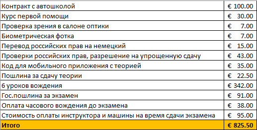

# Процесс и стоимость пересдачи на местные автомобильные права в Берлине в 2019 год

[Спустя более чем 3 года после переезда я все-таки созрел для того, чтобы пересдать на местные автомобильные прав](https://t.me/a_arkh/20)

Сегодня, 16 августа 2019 гола, успешно сдал уже и вождение! 👏🏻

Сразу на месте получил бумажку, по которой (в сочетании с паспортом, так как на бумажке нет фотографии) могу ездить по Германии. 

Через месяц могу идти менять ее на карточку, которую уже можно будет использовать где угодно.

Минус: при получении карточки необходимо безвозвратно сдать свои русские права. Слышал, что можно вроде как потом в России сказать, что потерял их, и восстановить, таким образом имея "запасные" права для поездок по разным странам. Надо будет уточнить этот вариант)

Вкратце, весь процесс выглядит следующим образом:
- [1. Контракт в автошколе и прочая подготовка](#1)  
- [2. Перевод документов](#2)  
- [3. Подача документов на проверку и подтверждение "упрощенной" пересдачи](#3)  
- [4. Обучение теории](#4)  
- [5. Теоретический экзамен](#5)  
- [6. Подготовка к практическому экзамену](#6)  
- [7. Сдача практического экзамена](#7)  

Вот так проходил весь процесс для меня, как для более-менее опытного водителя (но без достаточной практики в последнее время):

<a name="1"/>

## 1. Контракт в автошколе и прочая подготовка

**Заключил контракт** в [автошколе "Николай"](http://fahrschule-nikolaj.de/) во второй половине ноября 2018. 

Почему "Николай"? Да потому что хотелось ездить с русскоязычным инструктором, и уже несколько близких товарищей пользовались его услугами до этого момента, и были довольны.

На этом этапе мы расстаемся со следующими средствами:
	- 100€ - заключение контракта
	- 30€ - курс первой помощи (проходить ли его реально или же довольствоваться получением бумажки - на выбор обучаемого 😉)
	- 7€ - проверка зрения в салоне оптики
	- 7€ - биометрическая фотка
    
После заключения контракта с автошколой есть возможность раз в неделю (в моем случае по средам вечером) ходить случать теоретические лекции на немецком.
Но у меня по средам обычно всегда что-то другое по планам, так ни разу и не дошел.

<a name="2"/>

## 2. Перевод документов

**Перевести российские права на немецкий.** Я уже не раз пользовался услугами одного "доверенного" переводчика (с правом заверения перевода, которые необходим в гос.органах) в Берлине, поэтому могу смело его рекомендовать: быстро и дешевле многих конкурентов.

**Стоимость:** 15€

    Контакты берлинского переводчика:
        Wladimir Schilzow 
		vladi-s@gmx.de
		01795437809
		
        
<a name="3"/>

## 3. Подача документов на проверку и подтверждение "упрощенной" пересдачи
С документами из пунктов 1-2 записывался на [Umschreibung einer ausländischen Fahrerlaubnis aus einem Nicht-EU/EWR-Land (Drittstaat/Anlage 11)](https://service.berlin.de/dienstleistung/327537/) и **сдал свои русские права на проверку и подтверждение "упрощенной" пересдачи**

После этого до полугода ждать разрешения на сдачу. 
В моем случае было: подал запрос 29 ноября, получил разрешение по почте 14 мая

**Стоимость:** 43€
		
	
<a name="4"/>

## 4. Обучение теории
В это время можно начинать **учить теорию**. 

К слову, теоретический экзамен сдается на компьютерах, в программе есть несколько языков на выбора, в том числе и русский. Я для себя выбрал этот вариант, чтобы в стрессовой ситуации на экзамене дополнительный перевод не вызвал сложностей. Да и процесс подготовки на русском, очевидно, занимает меньше времени, чем на немецком с постоянным обращением к словарю.

Варианты:
- [бесплатное для членов клуба ADAC приложение для мобильного телефона](https://www.adac.de/produkte/apps/fuehrerschein/)

**Лайфхак:** можно воспользоваться картой знакомого при регистрации 😉 

**Плюсы:**: условно бесплатный, всегда с собой в телефоне оффлайн
    
**Минусы:**: только на немецком языке
    
- **"Führerschein 2018"** - бесплатное приложение с рекламой.

**Плюсы:**: бесплатный, всегда с собой в телефоне оффлайн
    
**Минусы:**: только на немецком языке, навязчивая реклама
    
- [сайт обучения на русском](https://ru.fuehrerschein-bestehen.de/fuehrerscheintest/fuehrerscheintest-in-russisch.aspx)

**Плюсы:**: поддерживается русский язык
    
**Минусы:**: платный (вроде 10 евро), нет приложения на телефон
    
- **FahrApp** - мобильное приложение 

**Плюсы:**: поддерживается русский язык, всегда с собой в телефоне оффлайн
    
**Минусы:**: платный (требуется код от автошколы за 35 евро)
            
Я пошел по пути наименьшего сопротивления и выбрал последний вариант. 

Учить начал лишь только после того, как получил разрешение на сдачу, раньше нет особого смысла: нужно просто прощелкать все 1100+ вопросов и запомнить те, в которых были ошибки)

**Стоимость:** 35€
	
<a name="5"/>

## 5. Теоретический экзамен
Стоит 22.5 евро за попытку. 

В случае провала пересдавать можно через 2 недели или через неделю, если со справкой от автошколы об очередной прослушки теории.

Всего вроде 30 вопросов, стоимостью от 2 до 5 баллов, в каждом вопросе допускается любое количество предложенных вариантов, от одного до вообще всех. Есть еще тип вопросов, когда просто одно поле для ввода числа, без вариантов ответа.

При сдаче допускается получить до 10 штрафных баллов суммарно, кроме варианта, когда неверно отвечаешь на 2 5тибальных вопроса.

Успешно сдал 2019-06-07 с 2 ошибками по 3 балла.

**Стоимость:** 22.5€
	
<a name="6"/>

## 6. Подготовка к практическому экзамену
После этого автошкола записывает своего ученика на сдачу вождения, обычно не раньше чем через 5 недель после теории.

За это время нужно **пройти достаточное количество практических уроков, чтобы чувствовать себя уверенным для прохождения экзамена**.

В случае "упрощенной" пересдачи, когда уже имеешь права другого государства, нет никакого минимального количества уроков, которые необходимо отъездить.
Можно даже после первого урока с инструктором сказать, что мне больше не надо, я буду ждать непосредственно сдачи.

Я же после первого вождения понял, что торопиться не стоит: столько местных нюансов, как постоянно несколько гиперболизировано демонстрировать оглядку через плечо, обращать внимание на указатель скорости после каждого поворота. 

В итоге Николай предварительно посоветовал мне забронировать еще 6 вождений, после 4го один вычеркнули, довольствовавшись пятью.
Стоимость одного полуторачасового вождения на механике в моей автошколе была 57 евро. Если получаешь права на автомат, то вождение на соответственной машине стоит немногим больше.

*Стоимость:** 6 * 57€ = 342 €
		
		
<a name="7"/>

## 7. Сдача практического экзамена
Предварительно в это же утро было чуть сокращенный урок вождения на час, чтобы проехаться по основным любимым маршрутам уже заранее известного экзаменатора.
Сам экзамен длится от 15 до 45 минут, по усмотрению того же экзаменатора.
    *Стоимость:** 
        91€ - гос.пошлина за экзамен
        38€ - оплата часового вождения до экзамена**
        95€ - стоимость оплаты инструктора и машины на время сдачи экзамена
        
<a name="resume"/>

## Итого
Все вместе мне встало в 825.5€

Да, достаточно недешевое удовольствие, особенного с учетом того, что я сдавал по "упрощенной" схеме, имея российские права и достаточный опыт вождения. 
Да и мне удалось закончить всё без дополнительных пересдач, то есть моя сумма - практически минимально необходимая для получения прав в Берлине на 2019 год.

Конечно, можно было бы еще несколько уменьшить итоговую сумму, сократив количество предварительных уроков вождения.

Но, как вы видите, стоимость одной лишь потенциальной пересдачи практического экзамена составляет аж 224€, а к ней еще надо добавить как минимум пару дополнительных предварительных практических занятий.

Да и сама пересдача была бы не раньше, чем через 5 недель, а может и позже.

Так что я решил немного перебдеть, чем недобдеть, о чем нисколько не сожалею.

Если же сдавать на права с нуля, то стоит готовиться к тому, что весь процесс выльется в чувствительно большую сумму.  
В этом случае, насколько мне известно, нужно откатать как минимум 15 обязательных предварительных практических занятий. Например, у моего коллеги суммарно в похожем случае всё вылилось в 2000 евро.

А мы скоро начнем пользоваться услугами Берлинского каршеринга!