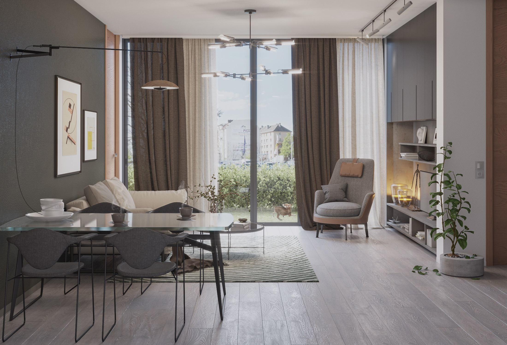
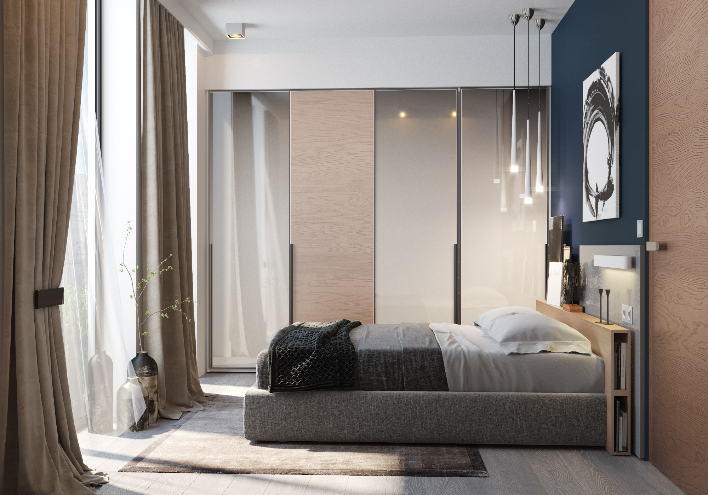
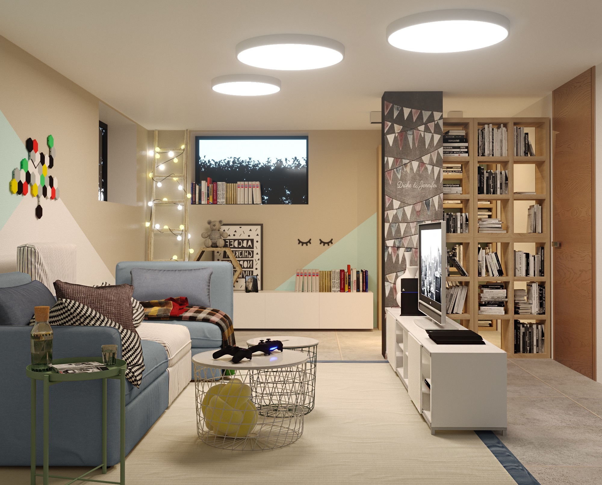
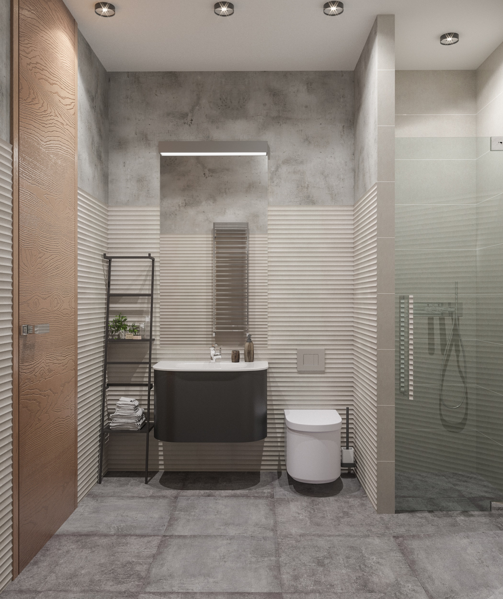
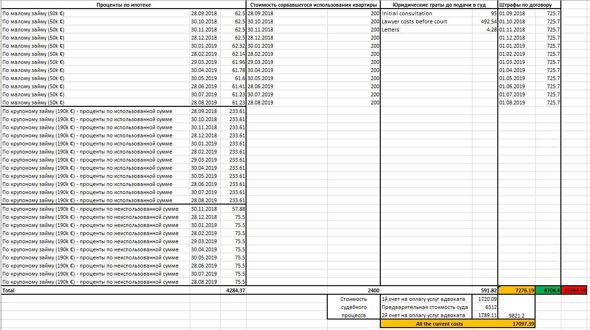
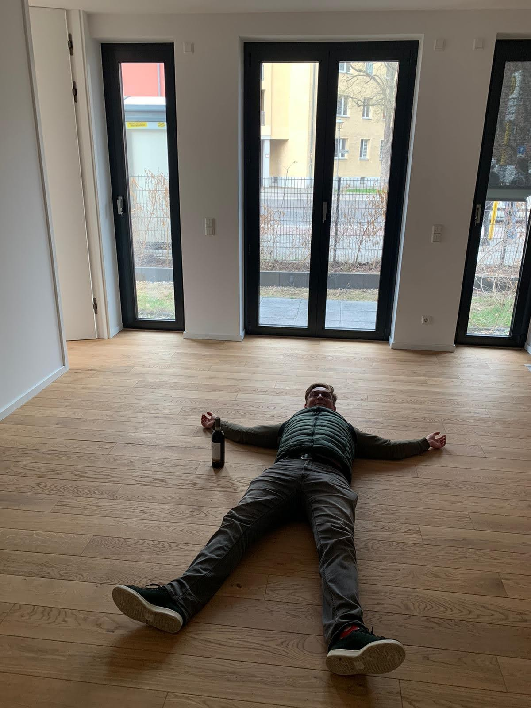

# Триллер по-немецки: история нашей покупки квартиры в Берлине или же описание тактики ведения бизнеса непорядочными компаниями в общем и некоего управленца в частности

**Внимание!** 

Все имена и названия компаний изменены. Любые совпадения - случайны.

В то же время, хронология развития событий и факты не изменены.

Так же заранее прошу прощения за некоторую затянутость: лонгрид писался на протяжении этих лет по ходу развития ситуации, вероятно, что-то лучше было бы и сократить 🙂

<a name="content"/>

## Содержание  
- ### [Лирическая предыстория, которую любители сухих фактов с легкостью могут пропустить](#preamble)  
- ### [Общие условия покупки квартиры и получения ипотеки в Германии](#common)  
- ### [Поиск и покупка квартиры](#search)  
- ### [Хронология развития событий после покупки, или душераздирающий триллер по-немецки](#chronology)  
- #### [Декабрь 2017 (9 месяцев до обещанного срока сдачи квартиры) - новое контактное лицо](#201712)  
- #### [Январь 2018 (8 месяцев до обещанного срока сдачи квартиры) - первый платеж по договору](#201801)  
- #### [Февраль 2018 (7 месяцев до обещанного срока сдачи квартиры) - первые "предпосылки" для задержки сдачи](#201802)  
- #### [Март 2018 (6 месяцев до обещанного срока сдачи квартиры) - выбор плитки, заказ кухни](#201803)  
- #### [Апрель - Июнь 2018 (5-3 месяцев до обещанного срока сдачи квартиры) - начало поиска детского сада в новом районе](#201804)  
- #### [Июль 2018 (2 месяца до обещанного срока сдачи квартиры) - нашли садик с ноября 2018, кухонные замеры на объекте, недостающая разводка](#201807)  
- #### [Август 2018 (1 месяц до обещанного срока сдачи квартиры) - сообщение о задержке сдачи](#201808)  
- #### [Сентябрь 2018 (1 месяц просрочки сдачи квартиры) - официальное письмо-претензия с нашей строны, переход на общение через адвокатов](#201809)  
- #### [Октябрь 2018 (2 месяца просрочки сдачи квартиры) - угроза "расторжения сделки" со стороны застройщика, поиск других пострадавших](#201810)  
- #### [Ноябрь 2018 - Январь 2019 (3-5 месяцев просрочки сдачи квартиры) - безуспешные попытки выйти на контакт, подготовление к подаче в суд на застройщика](#201811)
- #### [Февраль 2019 (6 месяцев просрочки сдачи квартиры) - подача иска в суд](#201902)
- #### [Июль 2019 (11 месяцев просрочки сдачи квартиры) - литовка получила квартиру, отказавшись при этом от всех претензий](#201907) 
- #### [Август 2019 (12 месяцев просрочки сдачи квартиры) - неуспешная попытка найти "устраивающее обе стороны" компромисса](#201908) 
- #### [Сентябрь 2019 (13 месяцев просрочки сдачи квартиры) - письмо от домоуправления с первым счетом за обслуживаение квартиры](#201909)
- #### [Январь 2020 (17 месяцев просрочки сдачи квартиры) - приглашение к регистрации на портале домоуправления](#202001) 
- #### [Февраль 2020 (18 месяцев просрочки сдачи квартиры) - первый судебный процесс](#202002) 
- #### [Март 2020 (19 месяцев просрочки сдачи квартиры) - решение суда](#202003) 
- #### [Апрель 2020 (20 месяцев просрочки сдачи квартиры) - застройщик подает апелляцию](#202004) 
- #### [Май - Август 2020 (21-24 месяцев просрочки сдачи квартиры) - наш переезд во временную съемную квартиру ближе к детскому саду](#202005) 
- #### [Сентябрь 2020 - Январь 2021 (25-29 месяцев просрочки сдачи квартиры) - более спокойное ожидание суда второй инстанции](#202009) 
- #### [Февраль 2021 (30 месяцев просрочки сдачи квартиры) - выигрыш в апелляции, попытка коммуникации во время ожидания вступления решения в законную силу](#202102) 
- #### [Март 2021 (31 месяц просрочки сдачи квартиры) - юридическое согласование соглашения о компенсации](#202103)
- #### [Aпрель 2021 - 1е апреля - никому не верю 😁](#202104)

- ### [Выводы из всей этой истории ](#Conclusions)

<a name="preamble"/>

## Лирическая предыстория, которую любители сухих фактов с легкостью могут пропустить
Несколько лет назад (а если быть точнее, то в конце 2015 года) мы с моей семьей переехали в Берлин. 
Предпосылок для этого было несколько.
- Во-первых, незадолго до этого в России жахнул экономический кризис, и покупательная способность рубля упала в 2 раза
- Во-вторых, в апреле 2015 у нас родился сын и жена официально и безболезненно до его трёхлетия находилась декрете.

Таким образом, когда мне поступило предложение о работе в Берлине - мы достаточно легко решились на такое "приключение".При этом успокаивали себя, что если что-то не пойдёт не так, как нам того хотелось бы, то всегда можно будет легко вернуться обратно в Москву, в добавок ко всему уже и обладая опытом жизни и работы в Европе.

В итоге, так и сделали, конечно же, столкнувшись по началу с рядом бытовых трудностей, о которых вкратце рассказывали [тут](https://m.youtube.com/watch?v=RdqQARdxH5I) и [тут](https://m.youtube.com/watch?v=EeFi1X6ozGQ).
Но сейчас речь пойдёт не об этом) 

 Так вот, если я изначально уже скорее всего мысленно уже и не думал о потенциальном возвращении в Россию, то Лена же не выкидывала из головы мысль, что, возможно, наше пребывание в Германии всего лишь временно. И, к сожалению, это усугублялось тем, что практически все время она находилась дома с маленьким Богдашей. Мысли о том, что все ее друзья и родные остались в России, и тут она никому не нужна, не давали ей покоя. Не особо помогали и малочисленные знакомства в чате русскоязычных мам Берлина. В итоге, где-то после 1-1.5 лет жизни в Берлине она не выдержала и заявила, что больше не может тут жить и хочет вернуться в Россию...

 Я, как верный и любящий муж 😊, отнесся к ее желанию с пониманием. Обновив своё резюме на НН я стал искать подходящие вакансии в Москве, параллельно сообщив об этом своему руководству. К моему же удивлению они сказали, что в любом случае заинтересованы в продолжении нашего сотрудничества даже на удалении. В итоге мы решили, что где то с осени 2017 года я вернусь в Россию и с этого момента будут работать на свою фирму как фрилансер удаленно, прилетая в Берлин раз в пару месяцев на недельку для живого обсуждения особо насущных вопросов. 
Сказать, что такой вариант развития событий выглядел для меня заманчиво - это не сказать ничего) 
 
Список плюсов было следующим: 
- Мало того, что компания стала бы переводить мне не мою брутто зарплату, а еще и процентов 20% сверх (те налоги, которые фирма платит со своей стороны сверху за содержание рабочего места),
- так еще и с этой брутто-суммы я платил бы в России всего 6% налогов (по упрощенной схеме ИП), вместо текущих ~32%;
- помимо этого, это вообще позволяло нам бы жить даже в Саратове, рядом с родными. По крайней мере, пока это совсем не осточерчело бы)) Все таки, как по мне, Москва - гораздо лучший для жизни город, если говорить только о России.

Потенциальные же минусы были:
- никто не мог гарантировать, что такое положение продлилось бы долго. В любой момент могло сложиться, что такое удаленное сотрудничество станет менее плодотворным (мой непосредственный шеф - человек, любящий контроль и совместные мозговые штурмы вживую);
- в любом случае мы рассматривали бы Саратов только как временную гавань:  как бы не было нам удобно в Саратове, но головой мы понимали, что это не самое лучшее место для взросления детей. В случае проблем с удаленной работой или просто ближе к школе предстоял бы еще один переезд, вероятно, в Москву. 

 До осени оставалось еще полгода, мы начали мысленно настраиваться и готовиться к переезду обратно в Россию. А тем временем в мае полетели с Леной отдохнуть на моря, предварительно сделав круг и завезя Богдашу к бабушке в Саратов. Отдохнули, и на обратном пути я полетел из Москвы напрямую на работу в Берлин, а Лена - в Саратов. Там она пробыла пару недель, попутно осматривая нашу квартиру, где бы планировали сделать ремонт и жить в дальнейшем, сориентироваться на местности и тому подобное. 

 Так вот... Повозя детскую коляску по разбитым саратовским тротуарам и поездя с ней же на общественном транспорта, в Лене зародилось зерно сомнения 😂 

 Вернувшись в Берлин и сравнив условия жизни на контрасте - зерно продолжило расти внутри) и через пару месяцев взошло, преобразовавшись в осознанное решение во благо будущей жизни детей (да и, вероятно, и наших собственных тоже, чего уж там😃) смириться с осознавание жизни на чужбине и остаться в Берлине.
Я был рад такому развитию событий и облегченно вздохнул, так как это лишало нас проблемы с подготовкой и организацией переезда)

Но в то же время это породило другой вопрос.

 Мы, как люди русские, в душе всегда имеем желание обзавестись и жить в своем собственном жилье, а не платить всю жизнь "дяде" за съемное. И, несмотря на то, что в Германии в общем и в Берлине в частности большинство семей живут в съемных квартирах (тут нужна ссылка по статистике), было решено задуматься и нам о приобретении тут жилья. Ведь ничего не сплочает семью лучше, чем совместная ипотека, не так ли?🤪😂

 <a href="#content"> К содержанию </a> 

<a name="common"/>

## Общие условия покупки квартиры и получения ипотеки в Германии

 Поразузнав примерные процентные ставки по ипотеке в немецких банках и цены на жилье, было решено продавать квартиру в Саратове, чтобы пустить вырученную сумму в фундамент приобретения немецкой жилплощади. Удаленно было дано объявление на Авито о продаже, в качестве контактного лица любезно согласился выступать мой тесть. Поверхностно зная ситуацию на рынке недвижимости Саратова, мы были готовы к тому, что процесс поиска покупателя может затянуться. Но звёзды сложились таким образом, что этот самый покупатель нашелся практически сразу. Правда, сложности добавлял тот факт, что молодой человек был кадровым военным, которому через неделю предстояла очередная командировка. Где наша не пропадала - и в экстренном порядке я срываюсь в Саратов и успешно улаживаю все бумажные вопросы за несколько дней. Сделка успешно закрывается, и вот мы уже находимся снова в Берлине с оставшимися в результате всех действий и семейных взаимозачетов 20к€. 

 Разведав более подробно нюансы о покупке квартиры в Берлине, выясняется, что помимо основной стоимости квартиры при покупке покупателю требуется так же оплатить еще и налог на покупку, услуги нотариуса по оформлению сделки и услуги маклера, что в Берлине составляет целых 6% + 2% + от 3.5 до 7% от стоимости квартиры соответственно. В некоторых банках могут дать в кредит 100% от основной стоимости квартиры, хотя это, конечно же, будет далеко не идеальным вариантом: лучше иметь порядка 20% стоимости квартиры своих и остальные 80% просить у банка. Но деньги на оплату всех дополнительных платежей у покупателя должны быть в любом случае сразу в наличии. 

 Путем нехитрых арифметических вычислений с учетом процентов обязательных платежей для покупателя (рассчитывая, что все такт получится найти подходящий вариант без помощи риелтора) и суммы собственных имеющихся на тот момент средств мы получили, что максимальная стоимость квартиры, на покупку которой мы могли рассчитывать на тот момент, была 250к€. Эта сумма все равно была чем-то космическим в нашем понимании на тот момент, поэтому изначально мы поставили для себя планку в 200к при поиске квартир. 

Наша ситуация при подаче заявки на кредит была чуть ли не худшей из всех возможных с вероятностью получения кредита больше 0%)
- один работающий член семьи
- на момент покупки квартиры и оформления ипотеки у нас еще не было бессрочного вида на жительство
- собственных средств хватало только на оплату обязательных сопутствующих платежей (и то только в случае варианта без маклера), то есть
нужна была ссуда в размере полной стоимости квартиры

В результате диапазон подходящих нам банков сузился до 1 - ING DiBa.
Получив в нем предварительное одобрение потенциального кредита, мы перешли в следующему и, одновременно, самому важному этапу - поиску квартиры. 

 <a href="#content"> К содержанию </a> 

<a name="search"/>

## Поиск и покупка квартиры
На нескольких самых популярных сайтах объявлений о купле-продаже недвижимости были настроены автоматические уведомления о новых добавляемых вариантах, удовлетворяющих следующим критериям:
- без риелторских комиссий
- 3 комнаты
- хорошее состояние: хотелось просто купить, заселиться и жить в радость, а не забивать себе голову дальнейшим ремонтом
- продажа без заселенных квартирантов: как мы уже рассказывали в видео по ссылкам выше, в Германии квартиросъемщики защищены законом, и даже в случае покупки квартир их будет очень трудно (а в некоторых случаях и вовсе невозможно) выселить из жилья, чтобы заселиться туда самому
- стоимость до 200к€

Стоит ли говорить, что результаты поисков по таким параметрам были немногочисленные?
Спустя некоторое время потолок стоимости был увеличен до 220к€, а потом и до 240к€. 

 В результате за примерно месяц с небольшим мы сходили всего на просмотр 3х вариантов вторичного жилья. Но все время в них было что-то не то: то нет балкона, то половицы уже скрипят от износа или, что еще хуже, видна плесень в углах. 

 А уж в случае, когда готовишься отвалить за квартиру космическую для себя сумму, попутно ввязавшись в ипотеку лет так на 25-30 - хочется все таки получить в итоге что-то близкое к идеалу, а не набор компромиссов. 

 Справедливости ради, последний просмотренный вариант был неплох и мы уже морально практически были готовы сделать предложении о покупке. Если бы не одно "но" - во второй половине того же дня у нас был запланирован просмотр квартиры в новостройке. 
 
Обычно мы не рассматривали новостройки по двум причинам. 
- Во-первых, ожидание. Пугала перспектива покупки на начальной стадии, начать выплачивать ипотеку, параллельно оставаясь жить на съемном месте, то есть по сути платить одновременно за 2 квартиры
- А во-вторых, средняя цена новостроек была раза в 1.5 выше аналогичных по площади вторичек, что объяснялось более современными строениями и свежим качественным ремонтом под ключ. 
 

 Этот же вариант попался на глаза и зацепил комбинацией того, что обещался к сдаче уже чуть ли не через пару месяцев и стоимостью в 240к€ за самую дешевую трешку. Мимо такого предложения было нельзя пройти просто так, и мы выехали на второй просмотр квартиры за день. Дело было в октябре 2017го. 

 Повторюсь еще раз: в объявлении было сказано, что дом будет сдан через пару месяцев. Какого же было наше удивление, когда по прибытию в оговоренный час по указанному адресу мы увидели хоть уже и полностью достроенную на всю высоту дома, но все таки полностью голую бетонную коробку. То есть ни о каких паре месяцев до сдачи уже готовой для заселения квартиры с отделкой и речи не шло. 

 В этот момент я предложил развернуться и уйти. Лена же уговорила меня все таки взглянуть в живую, раз уж мы уже проделали путь сюда. 

 Немец-продажник изобразил искреннее удивление по поводу указанной в объявлении дате сдачи и сказал, что это, конечно же, ошибка, но уверял, что стройка идет в хорошем темпе и все будет завершено месяцев через 10-11. К тому же, в случае покупки эта дата (сентябрь 2018) будет прописана в договоре отдельным пунктом с последующей неустойкой в размере 10 евро за каждый месяц просрочки. Этот момент заинтересовал нас, но еще больше - варианты свободных квартир. 

 Обычно самыми дешевыми квартирами среди аналогичных по метражу являются квартиры на по-немецки нулевом этаже EG (Erdgeschoss), что дословно переводится на русский как "земляной этаж", то есть этаж, находящийся вровень с землей. Обычно сюда же входит небольшой участок прилегающей территории, куда выходят двери, являющиеся балконными на этажах выше. Получается эдакий садик-терраса с газончиком. Что для нас с детьми является только дополнительным преимуществом в сочетании с чуть меньшей ценой) 

 Так вот, в данном строящемся доме были еще свободными 3 трехкомнатные квартиры на этом нулевом этаже: одна обычная "плоская" квартира площадью в 72 квадратных метра за 240к€ с садиком 40 метров, выходящим на северо-запад, и 2 квартиры площадью по 80 метров и стоимостью в 252к€ с садиками по 40 метров, выходящими на юго-запад. Так вот, эти 2 квартиры были практически двухэтажные!

 Ну... как двухэтажные)) Одна из комнат в них была ниже основного уровня квартиры, куда вела лестница из гостинной. Называется это "Hobbyraum", то есть комната для хобби. Такое просторное помещение с маленькими окнами под потолком, то есть где практически всегда без дополнительного освещения будет полумрак. Ремонт там обещали такой же качественный, как и во всей остальной квартире: паркет с подогревом и прочие ништяки. 

Чтобы вы понимали уровень обещаемой отделки - прилагаю некоторые визуализации с их сайта, посвящённому данному объекту: тут вы можете увидеть и обещанный паркет, и окна в пол, и даже, вроде как, эту хобби-раум:

И уж не знаю почему, но нам с Леной так понравилась данная планировка!

 Мы уже практически наяву увидели, как там будет наша спальня с проектором на стену, эдакий уголок, где мы сможем прятаться от детей)) Мне кажется, тут сказался наше советское происхождение: когда в советском союзе уже всем так осточертели типичные однотипные квартиры в панельных домах, что любое нестандартное решение является усладой для глаз и души)

 В общем, загоревшись этой идеей и переспав с ней ночь, мы решили остановиться на этом варианте с опущенной хобби-комнатой. Сообщив застройщику о нашей заинтересованности, мы попросили прислать нам черновик договора купли-продажи от нотариуса, который потом передали нашей хорошей немецкой знакомой, в прошлом работающей в сфере недвижимости, для ознакомления.

 Стоит отметить момент, что в первом варианте черновика договора отсутствовал обещанный пункт о неустойке в размере 10 евро за квадратный метр жилья по каждому месяцу просрочки. Но после моего упоминания этого пункта он был незамедлительно добавлен. 

В результате некоторой проверки договора знакомая предупредила нас о двух смущающих ее моментах:
- во-первых, договор заключался с немецкой фирмой, которая была открыта специально под застройку и продажу этого жилого объекта и носила название *Адрес дома GmbH*. Родительская же компания **SovetInvest GmbH** - это инвестиционная компания, зарегистрированная в Лондоне. То есть в случае потенциальных проблем со строительстве это могло внести дополнительную сложность;
- а во-вторых, та самая заинтересовавшая нас хобби-раум, площадь которой составляла аж 35 квадратов, официально по договору не входила в собственность, а всего лишь предоставлялась в право единоличного и безграничного пользования. Что на деле давало 2 негативных момента:
а) покупая 80 метров жилья и платя за них по 3.15к€ (252к€ / 80), официально в собственность получаешь всего 55, по факту заплатив за них аж по 4.58к€ (252к€ / 55). В случае последующей перепродажи в будущем это могла бы вызвать определенные трудности. 
б) был хоть и мизерный, но ненулевой шанс, что большинство жильцов может когда-то в будущем возмутиться таким "единоличным и безграничным пользованием" нами оплаченной же нами хобби-комнатой, вынести вопрос на рассмотрение общедомового совета и отобрать эту комнату у нас. Такие случае в немецкой истории, но сколько мне известно, бывали. 

 Так вот, если с потенциальными сложностями из-за британского происхождения инвестиционной компании застройщика мы еще были готовы смириться (все-таки русские души, полные авантюризма. Мол, где наши не пропадали!), то с пунктами 2-а и 2-б были категорически не согласны.

 Но так как мысленно мы уже практически жили в этом новом доме с ремонтом под ключ, то было решено переключиться на третий вариант трёхкомнатной квартиры на этом же этаже (мы, конечно, посмотрели на цены квартир и на других этажах, но там уже метраж стоил больше, что совсем выбивалось за рамки нашего бюджета). Та, которая обычная "плоская" квартира площадью в 72 квадратным метра за 240к€. 

 Мы ответили продавцу, что в связи с тем, что метраж хобби комнаты не входит покупаемый по договору, мы хотели бы рассмотреть вариант покупки этой оставшейся квартиры, если она была ещё доступна. В ответ нас пытались ещё заверить в том, что наши опасения совершенно напрасны и беспочвенны, и что это совершенно нормальная для Германии практика. 

В ходе этих уговоров мне написал e-mail некий **Адам Гальперонский** (он же **АГ** в дальнейшем), который до этого находился в копии переписки между мной, продажником и нотариусом. Он представился владельцем земельного участка и изъявил желание и готовность разрешить все смущающие нас моменты вживую по-русски. Мы созвонились, он ещё раз пытался убедить нас не отказываться от варианта с хобби комнатой, но в этом вопросы му уже были непреклонны. 
 
К слову, подпись этого господина АГ была: 
> Dipl.-Wirt.-Ing. A.Galperonskiy
>
> **Cyber Projektmanagements GmbH&Co.KG**
> 
> Amtsgericht Berlin - HRA 123456
>
> USt-IdNr.:  DE000000000

Уж не знаю почему, но в добавление к уже встречающимся ранее компаниям **Адрес дома GmbH** и **SovetInvest GmbH** тут добавилась новая. Ну да ладно, может у них и под земельный участок отдельная компания регистрируется. 

Но все равно предлагаю читателю запомнить имя этого человека. Оно ещё не раз будет упомянуто в ходе дальнейшего повествования. 

 В итоге мы остановились на этом новом варианте. Продавец с нотариусом начали подготавливать свои документы для оформления сделки, а нам ещё предстояло получить окончательное одобрение кредита в банке конкретно под этот объект. 

 К слову, для резервирования квартиры на время, пока документы будут проверяться банком для одобрения кредита и подготовки всех документа для оформления сделки у нотариуса, было необходимо оплатить 1% стоимости наперед. Но так как у нас каждый процент собственных средств был на счету и очень важен для оплаты некредитуемых платежей, то продавец пошёл на встречу и согласился забронировать квартиру без этой предоплаты. 

Сократим описание процессов финансирования и заключения сделки у нотариуса. 
Из интересных моментов стоит лишь упомянуть пару:
- Ещё до разговора с АГ я контактировал с двумя финансовыми организациями, помогающими получить финансирование. АГ же в ходе телефонного разговора упомянул, что чаще всего их клиенты получают финансирование как раз у одного из этих двух посредников. Это стало для меня ключевым фактором в выборе, и я тоже решил продолжить получение кредита через эту фирму. К тому же, одним из партнеров там был один приятный русскоязычный господин, который очень помог нам в коммуникации в ходе всего процесса финансирования. Какого же было мое удивление, когда позже выяснилось, что АГ ещё и требовал отдать ему комиссионный процент того самого приятного господина. 
- По документам владелицей фирмы **Адрес дома GmbH** была некая тоже русскоязычная фрау **Хелен Штоль** (в дальнейшем ХШ), она и присутствовала при оформлении сделки у нотариуса. 

Договор о купле-продаже был заключён в середине ноября 2017 года. Датой сдачи квартиры в нем стояло 1 сентября 2018.  

 <a href="#content"> К содержанию </a> 

<a name="chronology"/>

## Хронология развития событий после покупки, или душераздирающий триллер по-немецки
Изначально нашим партнером по коммуникации был тот самый немец, который показывал квартиру на начальном этапе, сотрудник фирмы **SaleGroup GmbH** (уже четвертая фирма в цепочке). Он же должен был быть в будущем начальником домоуправления, которое будет отвечать за все административные вопросы после сдачи дома. 

 <a href="#content"> К содержанию </a> 

<a name="201712"/>

### Декабрь 2017 (9 месяцев до обещанного срока сдачи квартиры) - новое контактное лицо

 Я получаю E-Mail, что контактное лицо для всех коммуникаций меняется, и вместо того немца, что показывал нам дом, отныне будет другой русскоязычный сотрудник.

 <a href="#content"> К содержанию </a> 

<a name="201801"/>

### Январь 2018 (8 месяцев до обещанного срока сдачи квартиры) - первый платеж по договору

 Получаем счет по оплате 1 и 2 частей стоимости квартиры (по договору вся стоимость разбита на 7 платежей, каждый из которых мы должны были оплачивать после завершения соответствующего этапа застройки) и оплачиваем его.

 <a href="#content"> К содержанию </a> 

<a name="201802"/>

### Февраль 2018 (7 месяцев до обещанного срока сдачи квартиры) - первые "предпосылки" для задержки сдачи

 Получаем уведомление, что "из-за плохих погодных условий стройка была заморожена на 1.5 месяца". Понятно, что начинают "подстеливать соломку" на случай будущей задержки сдачи, и на самом деле никаких критичных для строительства погодных условий в эту зиму не было. Ну да ладно, поживем - увидим.
В конце месяца получаем 3й счёт по квартире, оплачиваем.

 <a href="#content"> К содержанию </a> 

<a name="201803"/>

### Март 2018 (6 месяцев до обещанного срока сдачи квартиры) - выбор плитки, заказ кухни
Новый русскоязычный сотрудник пишет мне e-mail со словами:
> Антон добрый день,
>
> у меня не сохранился ваш номер. Наберите меня пожалуйста по возможности.

, что немного показывает серьезность ведения дел внутри фирмы. Не проблема, созваниваемся. Нас приглашают в офис для выбора материалов и цветов отделки. 
К слову, несмотря на то, что в подписи этого сотрудника указана фирма **SaleGroup GmbH** , встречаемся мы в офисе компании **Cyber**

 Приезжаем, выбираем один из трех цветов паркета (который, к слову, помимо того, что понравился больше всего, оказался еще и без доплат, в отличие от 2х других). 

 Но для выбора плитки нужно поехать в определенный магазин на окраине Берлина. Дают адрес и контактное лицо на месте, к которому стоит обратиться. Да, точно никакой предварительной записи не требуется, езжайте так, на месте все всё знают.

 Приезжаем - нужный человек оказался в отпуске. Другой человек в салоне занят со множеством остальных клиентов, деталей нашего процесса заказа не знает, но вроде мы должны просто выбрать подходящую плитку на ванную (пол и стены) и кухонный фартук, записать артикли и сообщить застройщику. Так и делаем.

 В итоге оказывается, что нужно было от специалиста в салоне получать официально оформленное предложение. Из-за того, что все не было сообщено заранее, нужно ехать еще раз в этот салон на окраине города. Едем и делаем всё, как запрашивают.

 По договору в стоимость квартиры входит плитка стоимостью до 40 евро за квадратный метр и размером не больше 40*40см. Если плитка будет больше по размеру (а нам в ванную понравилась размером 30*60), то из-за закладывания некоторого количества на отходы нужно доплатить 30% стоимости дополнительно. И то, что сама стоимость выбранной плитки стоит 30€ (то есть даже с дополнительными 30% выходит меньше дефолтной границы в 40 евро) - никого не волнует: 30% от ее стоимости надо оплачивать сверху и никак не компенсируется тем, что стоимость ниже лимита. 
Ну ОК, счет на 300 евро оплачен, особой погоды на фоне стоимости квартиры не играет, хотя осадочек добавляет... 

 Так же этот русскоязычный сотрудник говорит, что нам бы уже желательно в скором времени по-хорошему стоило определиться с кухней, так как строителям надо предоставить схему разводки. Советует нам один из салонов с кухонной мебелью, с которым сотрудничает наш застройщик и где нам дадут "хорошую скидочку". Но на месте этот салон оказался слишком элитным для нас: специалист сказал, что по идее на кухню стоит заложить процентов 10 от стоимости квартиры. 

 Но схему то разводки уже надо было предоставить строителям. Помимо этого, мы так же были наслышаны о том, что при покупке в крупных сетевых магазинах (таких как IKEA или Höffner) время после оформления заказа и до конца производства и финальной установки обычно занимает несколько месяцев. Выходим "на разведку", натыкаемся на акцию со скидкой в 30%, которая заканчивается уже сегодня. В итоге оформляем заказ в рассрочку.

 Нам подготавливают план разводки под запланированные кухонные коммуникации, которые мы пересылаем тому же самому русскоязычному сотруднику фирмы-застройщика.

 Посещение квартиры замерщиком для взятия финальных измерений планируется на конец июля, а ближайший свободный день для установки оказывается доступным лишь в начале октября. "Ну, ничего", думаем мы, "уж как-то проживем без кухни месяцок после сдачи квартиры в сентябре".

Ох, как наивны мы были тогда...

 <a href="#content"> К содержанию </a> 

<a name="201804"/>

### Апрель - Июнь 2018 (5-3 месяцев до обещанного срока сдачи квартиры) - начало поиска детского сада в новом районе

 В приятном ожидании своей собственной квартиры в европейской столице. 

 Периодически приезжаем к строящемуся дому, смотрим со стороны, радуемся прогрессу: стройка идет полным ходом.

 Параллельно задумались о вопросе детского сада: на тот момент наш Богдан ходил в русский садик относительно недалеко от нашей съемной квартиры на юге Берлина. 

 Нам там всё нравилось, но смущал один момент: в русском садике было несколько русскоговорящих воспитательниц и всего одна немка. Соответственно, немецкий язык к Богдану практически не прилипал, а время шло. Хотелось бы, чтобы к школе (а в Германии в 1й класс идут в 6 лет) с немецким у него было уже все хорошо, для чего, наверное, необходимо было вывести его из "зоны комфорта" и ввести в немецкоговорящую среду.

В то же время, в Берлине есть сложности с детскими садами:
- с одной стороны, тут вам практически социализм по этому вопросу: по закону, родители должны оплачивать только 23 евро ежемесячно за одноразовое питание ребенка, что является копейками. В некоторых садах (но далеко не во всех) берут дополнительные деньги на дополнительные приемы пищи и некоторые развивающие активности, но это не меняет кардинально стоимость - все равно остается гораздо дешевле того же соседнего Бранденбурга, прочей части Германии и других развитых стран;
- а с другой стороны, вроде, как присутствует огромная проблема с поиском места для своего ребенка: родители-немцы ставят своих детей в очередь в интересующие их сады аж чуть ли не сразу после рождения ребенка (что, в принципе, логично, так как декрет тут составляет максимум 12-14 месяцев).

В итоге на семейном совете было решено искать новый сад в небольшом радиусе от строящегося дома.

 Лена походила по округе, но, к нашему удивлению и расстройству, нигде не хотели даже добавлять нас в список ожидания даже на следующий год: все группы везде были полны, а при наборе освобождающихся мест всегда преимущество отдается братьям и сестрам уже посещающих сады детям.

 Пробую взять дело в свои руки: на Google картах находятся все садики в радиусе пары километров, ищутся их контактные E-mail адреса и всем пишется одинаковое письмо: мол, так и так, скоро переезжаем в Ваш район, есть ребенок, которого ОЧЕНЬ хотели бы пристроить в Ваш садик.

Не помогло. Если и отвечали, то только то же самое: мест нет и не будет...

 Где-то мы услышали, что с 3х лет каждому ребенку обязаны предоставить место в саду. Поэтому пошли в югендамт нашего нового района, рассказали о своей проблеме. Нас внесли в какой-то список и пообещали связаться, в случае подходящего варианта, но так за пару месяцев и не позвонили...

 <a href="#content"> К содержанию </a> 

<a name="201807"/>

### Июль 2018 (2 месяца до обещанного срока сдачи квартиры) - нашли садик с ноября 2018, кухонные замеры на объекте, недостающая разводка под кухню
Наконец-то звонят из югендамта! 

 Нашлось место в новом большом садике. Но, к сожалению, находится не прям рядом с домом: 3 километра на велосипеде или 25 минут на общественном транспорте с одной пересадкой.

 Это, конечно же, лучше, чем возить ребенка из новой квартиры в старый садик по часу в один конец, но тоже не самый лучший вариант... А ответ надо дать в течение дня, места разлетаются похлеще горячих пирожков. В итоге решаемся и соглашаемся. К тому же, может какой-то другой вариант как-то (хотя и маловероятно) найдем ближе потом, и можно будет перейти в другой садик.

 Место, правда, свободно было только с 1го ноября, то есть, теоретически, по нашим ожиданиям сентябрь и октябрь придется еще из новой квартиры по часу возить Богдана в старый садик... Но уж потерпим как-то пару месяцев, решили мы.
Ох, как наивны мы были тогда, дубль 2...

 В то же время на конец месяца у нас еще с марта предварительно запланировано посещение квартиры кухонным замерщиком. Это всё надо официально согласовать, чтобы не было никаких накладок и чтобы нас успешно провели на кухню. Ну и вообще, вдруг там на кухне пока голые бетонные плиты и замерять нечего (что, конечно же, маловероятно, сдача же через 1.5 месяца уже... но мало ли...).
Пытаюсь списаться и созвониться с нашим русскоязычным партнером по коммуникации - безрезультатно.

Но ничего, у нас же есть контактные данные АГ, который сам в самом начале процесса предлагал свою кандидатуру для решения всех непонятных вопросов. Пишу ему письмо на русском, так как до этого уже общались с ним, используя родной язык:
> Адам, добрый день!
>
> Это Архипкин Антон, XXXштрассе NN, кв.Z.
> Вот уже пару дней пытаюсь связаться с XXX Олегом, но безрезультатно. 
>
> Хотел бы узнать, как продвигается строительство и отделка.
> Каковы шансы, что квартиру сдадут как и предполагалось, до 1 сентября? только объективно, для понимания ситуации.
>
> Так же хотел бы спросить о возможности устроить термин с кухонным замерщиком как только отделка в кухонной зоне будет готова. Производство кухни займет 6 недель, так что хотелось бы произвести окончательные замеры по готовности отделки как можно раньше.
> Как продвигается этот участок, когда это может быть реализуемо?
>
> С уважением,
> Архипкин Антон 
 

 Господин АГ сам перезванивает мне, сообщает, что предыдущий сотрудник, с которым я пытался связаться, больше не работает у них, и теперь по всем вопросам мне стоит связываться непосредственно с ним. ОК, нет проблем. 
Мы согласовываем посещение нами с замерщиком объекта на 25 июля. Должны были подойти к вагончику бригадира на территории, дальше нас провели бы и все показали.

25го числа я приехал туда первым чуть раньше, но бригадира на месте не застал. Пишу господину АГ об этом, в ответ получаю от него номер бригадира:  

 Кстати, на аватарке господина АГ он изображен с некой дамой. Просматривая её в увеличенном масштабе, она показалась мне знакомой. Немного напрягшись, вспоминаю: да ведь эта та самая фрау ХШ, с которой мы встречались у нотариуса при заключении контракта! 
Оказывается, эта пара друг другу намного ближе, чем просто деловые партнеры! В прочем, в будущем подтверждение этому я еще получу и непосредственно от самого господина АГ, но сейчас не об этом.

В итоге, дожидаюсь бригадира без звонка, по приезду замерщика [мы в сопровождении с одним работником стройки](https://photos.app.goo.gl/5B4vd3fw8KjxjfMW6)  (*запомните, это в будущем еще всплывет*) проходим внутрь здания для снятия всех необходимых замеров. 

 В ходе осмотра квартиры и всего дома у нас возникают подозрения, что все-таки за оставшийся месяц, скорее всего, стройка не будет полностью завершена... Ну что же, морально мы к этому были готовы. Тем более в контракте есть пункт по возмещении просрочки, так что в материальном плане это не должно было на нас сказаться критично. 
Разве что Лена уже на последних месяцах беременности вторым ребенком и ей приходится карабкаться на 4й (по-русски) этаж в нашей съемной квартире, а мы все-таки мечтали переехать в свою квартиру на первом этаже уже до родов... 
Но сотрудники стройки говорят, что в течении пары месяцев скорее всего все будет завершено.

 Замеры были сняты успешно, но тот же специалист со стороны кухонной фирмы отметил, что разводка не подготовлена пока согласно нашему первоначально отосланному плану. 
Понятно, что это еще не финальная отделка и все еще может быть разведено как надо, но гипсокартон уже установлен со всеми вырезами, что внушает мне некоторое опасение. 
А, как внимательный читатель еще наверно помнит, сотрудник, с которым мы до этого вели все коммуникации и которому отправляли наш кухонный план, уже не работал в фирме. В результате во избежание всяких недопониманий и упущений я решаю уточнить причину неподготовленной запрошенной разводки у господина АГ. 

Звоню ему, объясняю ситуацию и суть своих опасений. Господин АГ просил меня переслать мой мартовский план разводки, который я отправлял предыдущему сотруднику. Я делаю это. Стоит отметить, что в том письме помимо непосредственно схемы разводки было и схематичное изображение собранной кухни. Было оно там только для того, чтобы у строителей было представление о том, что и как мы запланировали в пространстве.

Но господин АГ, судя по всему, не разобрался во всех вложениях, просто ответил мне (в переводе с немецкого):
> «План», представленный нам в качестве доказательства, является черновиком и не содержит ни размеров, ни понятной электрической и санитарной установки, Поэтому мы должны отклонить ваш запрос на исправление. Мы рады сделать предложение об необходимых изменениях, но это будет уже за дополнительную плату.

В результате, после череды звонков и разъяснения ситуации, господин АГ обещает разобраться в проблеме и предоставить мне обратную связь в скором будущем. Это было непосредственно в конце июля.

 <a href="#content"> К содержанию </a> 

<a name="201808"/>

### Август 2018 (1 месяц до обещанного срока сдачи квартиры) - сообщение о задержке сдачи
- 7 августа приходит e-mail от господина АГ, примерный перевод которого:
> О готовности квартиры к передаче Вам будет сообщено отдельно до 15го августа.
> Завершение же всего объекта, как и предполагалось, завершится до конца года. Поэтому мы советуем Вам пока не прекращать аренду Вашей текущей квартиры до конца года, чтобы процесс переезда был максимально комфортен

Интересно, кем это предполагалось, что завершение строительства состоится только в конце года? Ну ОК, подождем пока.

- До 15 августа никаких уточнение от господина АГ не последовало. Пишу в ответ с просьбой получить обновленный статус по передаче квартиры.
- В ответ от господина АГ приходит, что передача квартиры откладывается максимум до Нового Года, но строители будут делать всё возможное, чтобы закончить как можно раньше.
- Вежливо интересуюсь, как будет обстоять ситуация со штрафом за просрочку по договору и каким образом мне следует сообщить им свои банковские реквизиты для переводов 720 евро ежемесячно.
- На что получаю достаточно резкий ответ:
> Пожалуйста, ознакомьтесь с объявлениями о плохой погоде, а также с другими необходимыми техническими изменениями, вытекающими из требований противопожарной защиты. Вы не имеете права на какие-либо штрафы соответственно. Мы не будем платить вам. 
> 
> Мы с радостью обработаем договор купли-продажи и немедленно вернем вам оплату, которую вы оплатили. Кроме того, штрафы применяются, только если квартира была полностью оплачена. Поэтому это не так. 
> Поскольку Вами не были оплачены все платежи по договору полностью, то случае возникновения какого-либо конфликта между нами мы воспользуемся правом корректировки цены в соответствии с изменением рынка. 
> Мы просим вас прекратить тратить наше время на споры.
> 
> Вы имеете право посещать строительную площадку один раз в месяц.

Занавес. Сказать, что я выпал в осадок - не сказать ничего. Вот вам и хваленная Европа.

 Все, кому я ни рассказал об этой ситуации, в один голос заявляли, что мне "вешают лапшу", да я и сам был уверен, что г-н АГ и Ко ведут себя некрасиво и неправильно.

 Давали контакты разных адвокатов, проконсультировался с парочкой, но тарифы были очень недружелюбны: всё привязано к стоимости объекта спора, а тут это аж четверть миллиона. 
Так что даже просто начало сотрудничества с юристом выливалось бы в 500 евро, для того, чтобы адвокат составил грамотную претензию и вел некую коммуникацию на первых порах.
А в душе еще теплилась надежда, что вопрос все таки не требует каких-то особых вмешательств юристов и всё еще потихоньку разрешится само собой.

 К тому же, у г-на АГ и Ко еще и была "официальная" отсрочка на полтора месяца в связи с плохой погодой зимой (в скобочках написал, т.к. мне говорили, что по идее это не факт что уважительная причина - все-таки строительство изначально планировалось зимой, то есть должны были закладывать некий запас на погодные условия; да и, как я уже упоминал, той зимой не было никаких экстремальных условий). 
В результате было решено выждать и посмотреть на развитие ситуации. Вдруг за 2-3 месяца все будет сдано, как и обещали 🤞

А тем временем решил пользоваться своим правом на ежемесячное посещение объекта.
- 27 августа пишут г-ну АГ e-mail, что хотел бы на неделе посетить объект и посмотреть на текущее состояние. Когда это можно сделать?
- В ответ получаю отказ со ссылкой на пункт договора, что мы имеем право на посещение объекта только при получении очередного счета на оплату по завершению соответствующего этапа строительства. А пока там, мол, смотреть нечего.

Представляете, как у нас всё кипело внутри в то время? 
Забегая вперед, скажу, что это было еще цветочки...

 <a href="#content"> К содержанию </a> 

<a name="201809"/>

### Сентябрь 2018 (1 месяц просрочки сдачи квартиры) - официальное письмо-претензия с нашей строны, переход на общение через адвокатов

 Время шло...

 Наша хорошая немецкая знакомая фрау, в прошлом работающей в сфере недвижимости (я уже упоминал, что она помогала нам с проверкой договора купли-продажи) сама вызвалась помочь с составлением более официального письма с претензией о компенсации задержки.

 Но ответная реакция оказалась немного не той, что мы ждали: г-н АГ перезвонил мне и попросил больше не связываться с ним напрямую. 

 По его словам, в течении пары дней со мной должен был связаться его адвокат (спойлер: этого не произошло) и отныне все коммуникации должны были быть только через адвокатов.

 Наверное, он вполне логично посчитал, что мы во избежание немалых дополнительных трат всеми силами будем оттягивать момент найма адвоката.
В принципе, так и могло быть. Но в состоянии шока (а меня в тот момент опять начало нехило потряхивать от злости) я поступил по другому.

 На следующий день взял на работе отгул, отвел ребенка в садик, а потом пошел по отмеченным на Google-картах адвокатам. 

 Заходя, сразу спрашивал, занимаются ли они жилищными вопросами, вкратце описывая суть проблемы. Так же одним из условий было, что требовался адвокат, говорящий по-английски.
  
[Одно из бюро](https://goo.gl/maps/BbjrEDB1cwZYTYsu9) произвело на меня приятное впечатление, и я решил остановиться на нем. Да, как видите, я особо не заморачиваюсь над процессами решения. Вероятно, теперь [я знаю песню, которую можно было бы назвать гимном всей этой истории о покупке квартиры](https://www.youtube.com/watch?v=lwCAa4b9rrU).

 Первая консультация стоила 100 евро, адвокатом мне назначили (вероятно, по критерию необходимости английского) достаточно молодую девушку родом из Польши, что потом еще ни раз отмечали мои друзья как подтверждение основательности и взвешенности принятия мной решений в этой истории. 

 В процессе неё я поведал всю историю, обложившись распечатками повествования основных предшествующих событий. Заверив, что я действительно прав, мы решаем начать сотрудничество.

 Была озвучена стоимость 500 евро за весь процесс ведения коммуникаций, что, конечно же, не включало в себя дополнительных трат в случае потенциального затягивания дела до суда.

 Но, надеясь, что г-н АГ, увидя всю серьезность моих намерений, одумается и начнет вести наши дела согласно букве договора, тем самым заплатив мне минимум полторы тысячи € за предстоящую просрочку в 2-3 месяца. Это позволило бы и окупить затраты на эту помощь юристов, и получить что-то в качестве компенсации. 

Ох, как наивны мы были тогда, дубль 3...

 <a href="#content"> К содержанию </a> 

<a name="201810"/>

### Октябрь 2018 (2 месяца просрочки сдачи квартиры) - угроза "расторжения сделки" со стороны застройщика, поиск других пострадавших

 Как вы помните, у нас были предварительно назначены доставка и монтаж кухни на начало октября. Но так как г-н АГ уже уведомил нас, что передача квартиры переносится "на пару месяцев", то я связался с кухонной фирмой и предварительно перенес эту дату на начало декабря.

 В ходе повествовании всей нашей предыстории адвокату на консультации я так же упомянул проблему с разводкой коммуникаций под кухню. 

В результате, 5го октября наш адвокат пишет официальное письмо фирме **Адрес дома GmbH**, непосредственно с которой у нас и был заключен договор купли-продажи.
В этой претензии сообщается, что отныне это адвокатское бюро представляет наши интересы и выставляет продавцу квартиры следующие требования:
- подтвердить, что все коммуникации на кухне будут разведены согласно нашему плану, который мы отправляли им в марте и, повторно, в июле;
- подтвердить, что квартира будет готова к монтажу кухни к 5 декабря;
- дать нам право периодического посещения объекта;
- подтвердить, что другая сторона возместит нам ущерб, причиненный тем, что квартира не была завершена 1 сентября 2018 года вопреки плану.
Так же там упоминалось, что поскольку продавец знал, что проект строительства расчитан в том числе на зимние месяцы, ему следовало ожидать плохой погоды. Следовательно, вышеупомянутые объявления о плохой погоде, как правило, не приводят к отказу от ответственности продавца.

 Как вы думаете, уважаемые читатели, какая реакция последовала от продавца в ответ на данную претензию? При том, что претензия официально была подана уже адвокатом посредством факса?
Ни за что не угадаете!

 Через пару дней я получаю E-MAIL(!!!) от г-на АГ! То есть не мой адвокат, и не официальный факс или письмо, а я, и электронное сообщение!

Думаю, что в этот момент будет уместным еще раз отметить, что этот г-н АГ вообще официально не является по документам каким-либо образом причастным к нашему контракту: договор у нас заключен с фирмой **Адрес дома GmbH**, представителем которой выступала фрау **ХШ**. 
Собственно, я и видел эту фрау ХШ всего 2 раза: при оформлении сделки у нотариуса и на аватарке в Whatsapp'е у г-на АГ.

То есть я еще ни разу не видел никакого официального подтверждения, что г-н АГ - действительно лицо, с которым стоит вести общение. Не считая того, что когда мы писали письма или факс по официальным каналам фирмы **Адрес дома GmbH**, то ответ всегда поступал от его имени.

Ну так вот, этот г-н АГ в ответ на официальную претензию адвоката по факсу пишет мне обычное письмо на личный адрес электронной почты. Кстати, в этот раз у его подписи стоит уже **SaleGroup GmbH**, а не **Cyber Projektmanagements GmbH&Co.KG**. Точно запутать хочет, гад!

И уже даже лишь заголовок этого email'a может вывести и без того уже расшатанную психику незадачливого инвестора в сфере европейской недвижимости из уравновешенного состояния.
Этот заголовок гласит: **"Hausverbot"**

Само содержимое этого электронного сообщения тоже не внушало спокойствия:
> Уважаемый господин Архипкин, 
> 
> Настоящим мы даем вам полный запрет на дом и запрещаем вам доступ к нашей собственности.
> 
> Кроме того, мы заявляем об отказе от договора купли-продажи, как вы несанкционированно получить доступ к чужой собственности.
> Мы также оставляем за собой право подать в суд. 
> Отставка и заявление на Удаление уведомления о дефолте будет подано сегодня с нотариусом. 
> Мы, конечно, отменим оплату в рассрочку 
> Мы также отправим вам соответствующее уведомление в ваш банк передать.

Это становится последней каплей. 

 Я начинаю думать о том, что было бы неплохо найти других покупателей. Но как это можно сделать?

 На Facebook была страница по рекламированию продаж в нашем доме. 

 На страницу были подписаны 30 человек. Но, к сожалению, их список был закрыт.

 В то же время показывалось, кто лайкал публикации на этой странице. А обычно там публиковали фоторепортажи о ходе строительства.

 Пробежавшись по всем публикациям я пришел к выводу, что в числе постоянно лайкающих людей было всего 3-4 человека, и все они были подозрительно похожи на причастных к стройке.

 Но в то же время я нашел 3х людей, оставившие лайки всего под одним-двумя постами. Ознакомившись с их профилями, решают написать двоим из них. 

Для начала выбираю максимально нейтральный разведовательный вариант, чтобы не было назапланированных сложностей в случае, если они все таки как-то связаны с продавцом:
> Hello! we don't know each other, but I saw few of your likes on the page of the new building (https://www.facebook.com/xxx). 
> Therefore a question: may be you are the buyer of  a flat there? 
> I would like to find some others owners to be in the contact in future 🙂  

 Один из них оказался все таки дизайнером, работающим над этим объектом, но со второй девушкой мне повезло - она оказалась покупательницей квартиры в этом доме.

 В ходе общения выяснилось, что по ее контракту квартиру должны были сдать до конца июня, то есть задержка была даже на три месяца дольше чем мне.

 Её ситуация осложнялась тем, что после покупки квартиры она уже вернулась их Берлина в свою родную страну. И ожидала квартиры как инвестиции, чтобы начать сдавать ее.

 Она так же запрашивала компенсацию за просрочку, но тот же небезысвестный уже читателю г-н АГ в ответ начал предъявлять мифические претензии на дополнительные более дорогие материалы. Хотя, из-за своей удаленности, она даже не приходила ни на какие встречи и просто согласилась на качество материалов по умолчанию, которые уже входили в стоимость квартиры с отделкой.

 На этом она решила временно не эскалировать конфликт и просто ждать, так как вести юридические разбирательства из другой страны еще сложнее, чем делать это, находясь на месте.

Но мы продолжили держать друг друга в курсе о ходе развития ситуации.

 <a href="#content"> К содержанию </a> 

<a name="201811"/>

### Ноябрь 2018 - Январь 2019 (3-5 месяцев просрочки сдачи квартиры) - безуспешные попытки выйти на контакт, подготовление к подаче в суд на застройщика

 Все дальнейшие коммуникации с застройщиком теперь проходят исключительно через нашего адвоката.

 Мы запросили очередные предполагаемые даты передачи квартиры, но застройщик не отвечал даже на письма моего адвоката.

 Напомню, что последним ответом от них до этого момента был e-mail с "воображаемым" расторжением сделки и запретом для меня посещать объект стройки.

 В связи со всем вышеизложенным начинаем с адвокатом подготавливать иск в суд.

 Наш адвокат посылает оффициальный факс продавку квартиры, в котором сообщает, что мы даем им последний шанс для передачи квартиры и выплаты пологающихся по договору штрафов за период просрочки.

Никакого ответа не последовало, в результате завершаем подготовления для подачи иска.

 Изначально мы расчитывали, что предметом спора будет только выплаченная на данный момент сумма по платежам за квартиру, что составляло на данных момент 50.551,00 €

 В таком случае сумма судебных издержек составляла 5.734,60 €

 Конечно, в случае выигранного дела, проигравшая сторона обязана компенсировать все юридические траты. Но процесс, как и везде, дело небыстрое, а деньги нужно было платить "здесь и сейчас"... 

Я согласился. 

В тоже время адвокату приходит ответ от застройщика, где они сообщают следующие условия:
- г-н Архипкин (то бишь я) должен извиниться за свои постоянные телефонные "преследования" (почитайте перевод слова "Nötigung", очень забавно)

- мы переводим оставшиеся платежи по квартире (которые по контракту полагается оплачивать только по факту завершения соответствующего этапа строительства)
- тот же самый г-н Архипкин отказывается от дальнейших претензий по факту просрочки и прочего, нотариально заверив это у нотариуса 
При соблюдении этих пунктов нам предоставят якобы возможность установить кухню в конце января, а передача квартиры состоится в середине февраля.

В то же время противная сторона грозится предоставить в суде в качестве докательства:
- устные слова некого почтальона, доставившего мне документ о расторжении нашего договора (а я напомню, что никакой бумажки мы даже и не получали, был лишь только непонятный email)
- скриншот нашей переписки в г-ном АГ в вотсапе (опять же, я приложил его уже выше. никакого общения там по факту практически не проиходило).

Очевидно, что мы отказались от такого "щедрого" предложения.

 В то же время г-н АГ связывался по телефону с моим адвокатом, в ходе разговора обещав, что их адвокат в скором времени пришлет "более заманчивое предложение по урегулированию вопроса". 

Предложения так и не поступило.

 <a href="#content"> К содержанию </a> 

<a name="201902"/>

### Февраль 2019 (6 месяцев просрочки сдачи квартиры) - подача иска в суд

 Изначально обсуждалось, что будет подан иск в "ускоренный суд", который происходит за несколько месяцев.

 Но в результате адвокат предложила подать обычный иск, так как застройщик в ходе переписки никогда не сообщал, что наша квартира уже готова, а просто выражался, что передача "может быть произведена в ближайшем времени".

 Это могло бы вызвать дополнительные сложности.

 В итоге, мы согласились и подали иск в суд. Дело могло занять примерно один год, но оставалась надежда, что противная сторона, увидев наше серьезное намерение, решит пойти на мировую с нормальными условиями.

 <a href="#content"> К содержанию </a> 

 

<a name="201907"/>

### Июль 2019 (11 месяцев просрочки сдачи квартиры) - литовка получила квартиру, отказавшись при этом от всех претензий

 В ожидании суда, назначенного на начало 2020го, периодически обмениваюсь новостями с другой пострадавшей.

 28.07.2019 - литовка с ее отцом получили квартиру. При этом АГ и Ко предварительно вынудили их перевести оставшиеся платежи на их счет, тем самым усложнив получение штрафов за задержку в будущем. Эта самая задержка составила 1 год и 1 месяц для их контракта.

 <a href="#content"> К содержанию </a> 

<a name="201908"/>

### Август 2019 (12 месяцев просрочки сдачи квартиры) - неуспешная попытка найти "устраивающее обе стороны" компромисса 

 06.08.2019 - сижу в офисе, раздается звонок с незнакомого номера. Оказывается, что это фрау ХШ. Удивляется, почему же мы ничего не ответили на предложение от их адвоката. Я говорю, что их предложение оказалось для нас совершенно не интересным, так как просто получить квартиру без компенсации остальных наших потерь на юридические издержки и из-за просрочки квартиры - на данный момент этого уже не достаточно для нас. Что мы можем обсуждать на первом этапе - это что мы получаем нашу квартиру и компенсацию всех юридических затрат, потом уже можем переходить к следующим этапам. Она обещает обсудить это у себя, так же призывает нас подумать о компромиссах. В то же время фрау ХШ недвусмысленно призывает нас идти на компромиссы, иначе "это всё затянется еще на годы и мы ничего не получим". Так же всплывают какие-то "дополнительные работы", за которые, по ее словам, мы должны доплатить, но они будут готовы закрыть на это глаза)
 
Сразу же после разговора с ней перезваниваю своему адвокату, пересказываю звонок. Решаем, что мой адвокат в ближайшие дни выставит им наше встречное предложение: отдать нам квартиру, а так же компенсировать наши юридические затраты и сопутствующие задержке дополнительные траты (как погашение только ежемесячных процентов по кредиту без уменьшения суммы самого долга и "стоимость сорвавшегося использования квартиры" **Nutzungsausfallentschädigung**, что чем-то похоже на моральный ущерб за то, что мы по 2 часа в день возили ребенка в садик на другой конец города и ходили беременные и с детьми пешком на 4й этаж без лифта), и тогда мы можем закрыть глаза на причитающиеся нам по договору Strafgeld.

 В письме с нашим встречным предложением наш адвокат дал другой стороне время до 16 августа на раздумье.

 15 августа мне звонит г-н АГ, с предложением прийти к ним в офис на следующий день и обсудить конкретные суммы, так как 18го они улетают в отпуск. В случае, если мы найдем устраивающий обе стороны компромисс и заключим соглашение, то квартиру могут передать после их возвращения 26го числа.

 Мой адвокат не смогла присутствовать на этой встрече из-за другого суда в этот день, но дала добро на мой визит. Главное было, чтобы я не подписывал никаких документов при встрече, если у нас получилось бы прийти к устраивающему всех варианту, то соглашение предварительно следовало переправить ей на проверку.

А тем временем мой адвокат переслал мне 2 документа от суда, касательно нашего судебного процесса:
1. Копию письма от адвоката фирмы-застройщика суду от 8 августа, где их адвокат уведомляет, что мы и наш адвокат не хотим идти ни на какое соглашение, хотя его подзащитный "прилагает всевозможные усилия для мирового соглашения". Еще бы мы соглашались, если все их предложения до текущего момента были в стиле "мы отдаем Вам квартиру, а Вы подписываете, что снимаете с нас все материальные претензии"
2. Решения судьи о том, что **предварительное рассмотрение дела** с обязательным присутствием обеих сторон назначено на 12 февраля 2020 года. О - оперативность!

 Ну что же, идем на встречу, чтобы посмотреть на их "взаимовыгодные предложения по урегулированию конфликта".

Со своей стороны, я подготовился ко встрече, составим таблицу наших фактических и потенциальных потерь за год просрочки:

 Моя позиция перед встречей была та же, что мы написали им в нашем встречном предложении: мы готовы были закрыть глаза на зеленую сумму штрафов по договору, если продавец компенсировал нам "желтую" сумму и передавал квартиру в пользование в кратчайшие сроки. Даже мысленно я был готов согласиться получить только часть верхней желтой суммы (7.3k€), нижняя же сумма стоимости судебного процесса должна была быть полностью погашена продавцом. К слову, она могла бы стать чуть меньше, если продавец соглашался с нашей правотой и мы отзывали бы наш иск при получении квартиры: тогда она могла быть уменьшена примерно на треть, с 10k€ до 6-7k€.

Распечатав данную таблицу с расчётами, я пошел в офис **Cyber Projektmanagements GmbH & Co.KG** 16го августа к 16:00.

Насколько высоки были мои оптимистичен ожидания от встречи, настолько ожидаемо безрезультатно всё и обернулось в очередной раз. 

Краткие по-абзацные выжимки из монолога г-на АГ, так как большую часть времени меня пытались давить авторитетом, вынуждая к принятию их предложения:
- похожая ситуация с покупателями квартир у них не первая не только на данном объекте стройки, это их привычный стиль ведения бизнеса
- я оказался первым их «клиентом» по данному объекту застройки, которому они готовы выплатить лишнюю копейку, чем, безусловно, польстил моему самолюбию
- узнавав стоимость услуг моего адвоката, г-н АГ отметил, что все прения со мной встали его фирме уже в 11000 евро, а вообще на данный объект у них заложено 150к евро данному адвокатскому бюро
- при этом он отметил, что в случае, если мы будем продолжать выражать несогласие с политикой его фирмы, то наш процесс затянется на годы вперёд, перейдя в последствие в суды второй и третий инстанции: при этом не раз отмечалось, что они - люди (и фирма) богатые, а я уже так неслабо вложился во все эти судебные тяжбы, и просто так этого всего не потяну
- одной из дополнительных угроз выступало то, что я буду лишь терять деньги по ходу судебного разбирательства, а они - навариваться, так как планируют сдавать мою квартиру до момента передачи мне её
- следующим убедительным "гвозьдем в крышку" моей уверенности в очередной раз выступила угроза, что они вообще планируют закрыть или продать данную фирму, не дожидаясь закрытия всех обязательств. В ответ на моё робкое несогласие, аргументируемое тем, что с с юридической точки зрения это должно быть трудно реализуемой задачей -  я был заверен, что найдётся немало кандидатов выкупить фирму подешевле со всеми долгами, чтобы забить на неё в последствие. В чем логика такого выгодного коммерческого предложения - до сих пор не понимаю...
- начинал г-н АГ с того, что в случае нашего мирового соглашения они согласны погасить только часть моих некомпенсированный судебных издержек (там немного размыто все, в в таком случае из оплаченных 6.3к суду мне должно было бы вернуться порядка 4к, остальные 2.3к компания г-на АГ согласны были бы погасить), но не стоимость моего адвоката. Так же не согласны они были компенсировать никакие из других фактических потенциальных и фактических наших убытков за время просрочки
- как вы знаете, мои минимальные ожидания были, что я получаю компенсацию ВСЕХ своих судебных издержек (включая услуги адвоката, т.е. 3.5к евро + сколько там ещё не вернётся от стоимости суда в случае мирового соглашения), а помимо этого около 7к евро в качестве компенсации различного ущерба и стоимости недополученного использования. По факту, это выходило порядка 12к евро на момент нашей встречи, морально я был готов опуститься до 10к
- в итоге, последним предложением г-на АГ стало то, что мне дают 5к евро  и ни копейкой больше; при этом я отказываюсь от всех остальных претензий. Как вы понимаете, этого не хватало даже для компенсации того, что я уже оплатил только лишь на стоимость судебного процесса и связанных с ним юридических работ, даже после потенциального возврата судом примерно 2к евро если бы мы нашли вариант мирового соглашения непосредственно до заседания суда.
- ну, и завершающим и наиболее убедительным аргументом г-на АГ выступило то, что он знает о том, что я уточнял о его личности в кругу наших общих берлинских знакомых. И мало того, не только уточнял, но ещё и как будто склонял их к каким-то криминальным действиям в его сторону. Вы же все знаете меня как знаменитого саратовского криминального авторитета? Так вот, г-н АГ грозился подать на меня в суд за угрозу его жизни!!!

Как это несложно предположить, я вышел из офиса компании **Cyber Projektmanagements GmbH & Co.KG** «несолоно хлебавши».

Хотя, конечно же, полноценным офисом назвать это сложно: 
- это, бесзусловно, хороши бизнес-центр в центре элитного района Берлина, чего только стоит адрес Кудамм 45
- но на вывеске подъезда нет никаких упоминаний о такой крупной и успешной компании
- после безуспешного поиска в перечне списка компаний на входе и моего звонка непосредственно г-ну АГ оказалось, что хоть на официальных вывесках их компания и не присутствует, но ее можно найти при листании компаний на электронном табло домофона
- после успешного проникновения в здания (как бы по итогу это опять не было объявлено как что-то криминальное) оказалось, что на указанном этаже главные вывески ознаменуют совершенно другую компанию. Наш же г-н АГ пригласил нас лишь в определенную переговорную, да и при вопросе о туалете собрался предоставить ключ, к которым следовало спуститься] на этаж ниже и потом вернуть обратно. Я решил потерпеть. 
Лично мой вывод: компания **Cyber Projektmanagements GmbH & Co.KG** снимает в элитном бизнес-центре на Кудамме лишь лишь часть 3го этажа, как простые айти-фрилансеры в каком-то ко-воркинге. 
P.S. B этом нет ничего плохого
P.S2 Я могу быть неправ в свои данных выводах

Но общее впечатление после встречи с господином АГ вы уже поняли: 
- всё дальнейшее общение - только через моего адвоката
- личная встреча - только в суде 

В прочем, в понедельник г-н АГ в WhatsApp последний раз предложил компенсировать 7к, но получив отказ, распрощался до встречи в суде.

 <a href="#content"> К содержанию </a> 

<a name="201909"/>

### Сентябрь 2019 (13 месяцев просрочки сдачи квартиры) - письмо от домоуправления с первым счетом за обслуживаение квартиры

 Неожиданно получаем письмо от домоуправления (которое по факту является другой дочерней компанией той же самой главной компании, и у руля домоуправления стоят те же самые г-н АГ и фрау ХШ) с требованием заплатить за первый месяц обслуживания нашей квартиры.

 После консультации с адвокатом я отправил им ответное письмо, где попросил подтвердить, означает ли это, что наша квартира готова к сдаче (подтверждение оказалось бы нам на руку в ускорении процесса в суде). Но ответа больше не последовало...

 Так же я запросил у адвоката расширение нашего иска, чтобы мы сразу включили сумму за задержку в предмет спора, помимо права получения квартиры.

 <a href="#content"> К содержанию </a> 

<a name="202001"/>

### Январь 2020 (17 месяцев просрочки сдачи квартиры) - приглашение к регистрации на портале домоуправления

 Мы находились в отпуске, паралельно ожидая суда 12 февраля.

 27го числа неожиданно приходит электронное письмо, с предложением зарегистрироваться на портале домоуправления.

 После регистрации обраруживаю в папке входящих сообщений на портале приглашение прийти 10го февраля к 9:00 на передачу квартиры и подписи соответствующего акта.

 Пересылаю всю информацию адвокату с просьбой пойти на эту встречу вместе с нами для коммуникации и консультации нас в процессе подписи этого акта.
Оказывается, что это передача общедомовой территории и нас это, к сожалению, пока не особо касается...

 <a href="#content"> К содержанию </a> 

<a name="202002"/>

### Февраль 2020 (18 месяцев просрочки сдачи квартиры) - первый судебный процесс

 12го числа состоялся судебный процесс. Со стороны ответчика на нем присутствовал только адвокат. В очередной раз стала ясна их тактика - тянуть всеми средствами время, при этом пытаясь получить от нас все последующие платежи до передачи квартиры, тем самым усложняя нам процесс получения компенсации за просрочку. Даже на прямой вопрос судьи «Готова ли квартира истца» не было дано никакого ответа, ссылаясь на то, что сам адвокат в ней не был и у него нет с собой телефона для связи с ответчиком. 

 В немецких судах решение не оглашается сразу, а приходит позже по почте. Так что мы удалились из суда ожидать это решение веря, что оно будет в нашу пользу. 

 <a href="#content"> К содержанию </a> 

<a name="202003"/>

### Март 2020 (19 месяцев просрочки сдачи квартиры) - решение суда
Получаем решение суда. 
Как и ожидалось, оно в нашу пользу:
- контракт купли-продажи квартиры остаётся в силе;
- застройщик должен выставить нам следующий счёт, одновременно с оплатой которого должна состояться передача квартиры;
- все понесённые нами юридические расходы должны быть покрыты застройщиком;
- так же нам полагается компенсация за просрочку в размере 12.9к евро. 

При этом решение еще не вступило в законную силу. Застройщику предоставляется есть один месяц на апелляцию. 
- Если до 6го апреля не будет подано апелляции, то решение вступает в силу. В этом случае мы можем требовать в середине апреля передать нам квартиру принудительно через судебных приставов, забрав при этом с нас следующий платеж в размере 27к для передачи его застройщику;
- если же будет апелляция, то дело передается в инстанцию выше (Kammergericht Berlin). Сколько оно продлится в этом случае - не известно;
- даже в случае такой апелляции у нас есть вариант перевести некий гарантирующий платёж в размере 36к евро (мне так до сих пор точно и не ясно, каким образом рассчитана данная сумма) на счёт суда в качестве депозита, и получить квартиру через приставов. Но при этом это не отменяет необходимости иметь в наличии всю сумму за последующие платежи по договору, то есть не могут использоваться средства с ипотечного счета. Т.е. это должна быть некая непонятно откуда дополнительно взятая сумма, что для нас, как не представителей олигархии, являлось трудновыполнимым условием... Теоретически можно было бы продать почку или попытаться взять очередной кредит в банке, так как этот депозит по идее должен был вернуться судом после окончательно завершения тяжбы. 

 Но в итоге, в любом случае разумно было подождать пока до 6го апреля. Все таки оставалась надежда на некоторую разумность застройщика, ведь подача апелляции в инстанцию выше сулило дополнительные затраты и для них. 

 <a href="#content"> К содержанию </a> 

<a name="202004"/>

### Апрель 2020 (20 месяцев просрочки сдачи квартиры) - застройщик подает апелляцию

 Несмотря на всю неразумность такого решения, застройщик всё-таки подает апелляцию. Из-за "короны" в частности и просто медленной судебной системы в целом, апелляцию назначают на начало февраля 2021...

 <a href="#content"> К содержанию </a> 

<a name="202005"/>

### Май - Август 2020 (21-24 месяцев просрочки сдачи квартиры) - наш переезд во временную съемную квартиру ближе к детскому саду

 Наша чаша терпения уже переполнена окончательно. Возить двоих детей через весь город в сад становится невозможным, так что мы решаемся на поиск новой временной квартиры и переезд туда. Все прошло на удивление быстро, нам повезло найти новую квартиру в 10 минутах на велосипеде от садика (пусть даже и на 200+ евро дороже при чуть меньшем метраже, но со встренной кухней, лифтом и удобной инфраструктурой). 

 <a href="#content"> К содержанию </a> 

<a name="202009"/>

### Сентябрь 2020 - Январь 2021 (25-29 месяцев просрочки сдачи квартиры) - более спокойное ожидание суда второй инстанции

 В связи с переездом можем уже позволить себе без нервов жить в ожидании суда второй инстанции. Случается второй локдаун из-за короновируса, я меняю работу, Лена тоже находит работу на 15 часов в неделю. Жизнь течет своим, пусть и не совсем нормальным, чередом =)

 Меня тем временем нашли другие жильцы дома (у них был список владельцев всех квартир), добавили в WhastApp группу владельцев, где те обсуждали периодически возникающие проблемы.

 Судя по всему, агрессивная тактика ведения бизнеса г-ном АГ работала достаточно успешно: из 52 квартир в доме - 49 были уже сданы владельцам.

 Насколько я понимаю, все они согласились выплатить все последующие счета при получении и отказались от своих претензий за просрочку.

 И только 2 дамы кроме нас перешли в судебные разбирательства за свои права.

 У нас с ними появился свой собственный чатик для обмена новостями.

 Правда, одна из них каким-то непостежимым образом проиграла свое дело: суд постановил ей компенсацию всего 2.5к евро за просрочку, при этом поделив все юридические траты пополам между ней и застройщиком. То есть она оказалась в минусе по итогу: все ее траты легли на нее же и остались некомпенсированными. Она была уже слишком усталой, и решила не обращаться в следующую инстанцию. Оплатила последующие платежи за квартиру и получила ее.

 У второй же дамы, пошедшей так же в суд, первое заседание было назначено на март 2021, то есть даже после 2го заседания по нашему делу. При том что в суд она подала в сентябре 2019, то есть из-за короны это растянулось у нее на 1.5 года.

 Желаем ей, как и нам, удачи!

 <a href="#content"> К содержанию </a> 

<a name="202102"/>

### Февраль 2021 (30 месяцев просрочки сдачи квартиры) - выигрыш в апелляции, попытка коммуникации во время ожидания вступления решения в законную силу

 За время ожидания апелляции в нашем адвокатском бюро произошли очередный кадровые изменения, и мы уже во второй раз получили нового адвоката. На этот раз нам повезло, и это оказалась русскоязычная адвокат. Это облегчило процесс коммуникации и сделало созвоны для обсуждения более понятными.

 В начале февраля состоялась апелляция. Никаких новых и разумных контр-доводов адвокат застройщика не удосужился привести, так что решение осталось в нашу пользу практически без изменения. 

 Застройщика обязали выплатить нам 12+ тысяч евро в качестве штрафа за просрочку + выставить следующий счет, одновременно с оплатой которого должна состояться передача квартиры. 

 Так же они должны практически полностью компенсировать наши юридические траты. На данный момент это составляет уже более 20 тысяч евро...

 Напомню, что изначально тактикой застройщика было вынудить нас оплатить все последующие платежи за квартиру (а у нас в контракте было 7 разных этапов строительства, по мере прогресса каждый из которых должен оплачиваться отдельным счетом). В этом случае нам было бы тяжелее получить с них компенсацию в последствии, так как они могли бы просто попытаться объявить себа банкротом сразу после получения денег. 

 Суд же как раз постановил, что для передачи мы должны оплатить только 5й счет, тем самым 6 и 7 счета в последствии могли бы быть использованы нами для компенсации наших финансовых потерь. Их, правда, не хватало в полном объеме, но лучше уже, чем ничего.

 После решения суда в письменной форме необходимо было ждать еще месяц до вступления решения в силу. Мы могли бы попытаться в это время уже выставить какие-то требования сами, либо же с помощью адвоката. Во втором случае, опять же требовалось дополнительно платить за это бешеные деньги (3420€) только за работу адвоката, при этом не было никаких гарантий в успехе этого шага.

 Поэтому было решено дождаться вступления решения суда в законную силу, а параллельно тем временем написать АГ с вопросом, не хотят ли они ускорить процесс выполнения всех обязательство по сделке и произвести компенсацию полагающихся нам штрафов уже в рамках 5го счета.

В ответ АГ перезвонил мне.
В своей несколько агрессивной манере он говорит, что по его мнению:
- он еще не решил до конца, пойдут ли они в инстанцию выше на очередную апелляцию;
- для получения квартиры мы должны оплатить ему одновременно 5 и 6 счета по договору;
- мы можем обсуждать компенсацию, присвоенную в суде: 12.000 и компенсацию юридических трат, которые, правда, по его мнению составят всего порядка 3.000 евро, а не что-то в районе 20.000;
- так же мы "всё еще должны обсудить компенсацию дополнительно установленных дорогих дверей и прочего";
- и, если что, то он может просто запустить кого-то жить в нашу квартиру, пока мы еще её не получили.

 В ответ на это я сказал, что тогда мы будем ждать вступления решения суда в законную силу и потом будем работать через судебных приставов, если же он хочет изменить тактику - то пусть пишет свои предложения моему адвокату.

Спустя недолгое время он перезванивает мне во второй раз и уже более дружелюбно сообщает:
- что он созвонился с адвокатом и они не собираются более подавать апелляцию и заинтересованы решить вопрос быстрее;
- что для получения квартиры мы должны оплатить ему одновременно 5 и 6 счета по договору, НО они согласны компенсировать при оплате этих счетов полностью ВСЮ сумму, которую постановил суд (то есть 12.000 + порядка 20.000 за компенсацию наших юридических расходов).

 Я, конечно, не верю ему на словах, но он сказал, что в ближайшее время они пришлют то ли счета на оплату, то ли начнут обсуждение соглашения по компенсации.
Ну что же, посмотрим на развитие ситуации.

 На следующий день от г-на АГ пришло электронное письмо с предложением компенсации наших юридических расходов и штрафных санкций при оплате 5 и 6 счетов.

 Письмо было направлено мне на личный е-mail адрес, в копии письма так же находился адвокат другой стороны.

 Выглядит слишком хорошо, чтобы быть правдой) 

 Пересылаю это письмо адвокату с просьбой произвести весь дальнейший процесс по согласованию и оформлению правильно с их помощью.

 Как уже упоминалось выше, любой чих с помощью адвоката стоит больших денег. Так что спрашиваю, сколько будет стоить данный этап и прошу разрешение оплачивать счет в рассрочку и с отсрочкой (так как в данный момент только начал выплачивать им счет за предоставление моих интересов в выигранном суде второй инстанции).

 <a href="#content"> К содержанию </a> 

<a name="202103"/>

### Март 2021 (31 месяц просрочки сдачи квартиры) - юридическое согласование соглашения о компенсации

 Несколько дней не могу дозвониться до адвоката, в итоге обсуждаем с ней, что она начнет процесс оформления компенсации при выставлении следующих счетов застройщиком. Подписываю очередную доверенность, что их бюро может представлять мои права на этой стадии.

 Так же очень прошу поторопиться, так как звонок был в прошлый четверг, е-mail - в пятницу под вечер, а сейчас уже вторник-среда. В ответ получаю: "Постараемся на этой неделе отправить первое предложение, но не обещаем". Германия.

В итоге лишь через неделю в среду получаю копию ответного письма нашего адвоката застройщику.
Наш адвокат рассчитала примерно сколько будет составлять компенсация за юридические траты и предлагает:
- из 5го счета компенсировать 12к штрафов за просрочку и 7.5к как 100% юридических трат за суд 2й инстанции (то есть 26к -  20к = 6к остаётся с нас за 5й платеж по квартире)
- из 6го счета вычесть 90% юридических трат за первую инстанцию (то есть 15к - 11к = 4к остаётся с нас за 5й платеж по квартире)

 По предложению адвоката, эти 6 + 4 тысячи € мы переводим на счет застройщика при условии получения квартиры сразу после этого. После же получения окончательных расчётов суда уже оформить последующее окончательное соглашение по взаимозачёту.

 Дождались письма от застройщика, где он согласен с предложенными условиями. Но формулировка какая-то угловатая. Согласование уходит еще на один раунд обмена письмами.

 В итоге все растягивается на месяц... Лишь 26го числа получаю наконец отмашку от адвоката, что можно переводить деньги, отправляю запрос в банк, чтобы они перевели 10к на новый банковский счет застройщика.

 30го марта получаем от банка подтверждение, что запрошенный перевод совершен.

 Паралельно с этим подготавлию запрос на новый перевод: аргументирую, что наша согласованная компенсация в размере 31к € нам просто жизненно необходима для покрытия текущих счетов адвокатов и прочее. Шансов, однако, практически нет... Скорее всего, в лучшем случае получится уменьшить заём на эту сумму, либо же пытаться решить вопрос с участием адвоката, но опять же без гарантии.
 

 В этот же день АГ сообщает, что деньги дошли, и предлагает передать квартиру на следующий день в 13 часов, или через день в 9:00.
Предпринимаю все возможные попытки, чтобы за такие сжатые сроки найти эксперта, который может проверить качество ремонта и убедиться, что все запрашиваемые нами коммуникации под купленную кухню подведены правильно (Gutachter für die Wohnungsabnahme).

 Но в Германии это оказывается непосильной задачей. Нужно записываться как минимум за пару недель, иначе шевелиться никто не будет, даже с доплатой за срочность. Это вам не Россия 🥺 

 Решаю пойти на передачу с адвокатом (за отдельные 250 евро в час), при этом обезапасив себя от каких-то роковых расписок, но быть готовым к тому, что еще придется вызывать оценщика потом. Так же пытаюсь найти среди товарищей футболистов кого-то разбирающегося в стройке и способного заметить хотя бы крупные "косяки" в отделке, проводке и сантехники. Что, в принципе, тоже оказывается непростым делом в рабочее время за сутки до даты...

 

 В итоге, удача оказывается на нашей строне: через хорошего знакомого с Мозгобойни (такая командная интеллектуальная игра) нахожу опытного человека, который сам руководит строительным объектами уже не первый год. Он соглашается помочь в приемке квартиры.

 При этом уточняет, какова будет наша тактика: либо же придираться по максимуму и запрашивать все полагающиеся по закону протоколы и документы, либо же просто проверяе и принимаем квартиру в состоянии, котором она есть, с пометкой о "косяках". 

 Мы уже, как понимаете, намучались со всем этим процессом и просто хотим получить квартиру.

 <a href="#content"> К содержанию </a> 

<a name="202104"/>

### Апрель 2021 - 1е апреля - никому не верю

 Утром 1го числа состоялась передача квартиры. На удивление, все вполне неплохо! Вносим в протокол несколько замечаний, которые обещают исправить в течение следущей недели. Подписываем протокол, получаем заветные ключи. УРА!!! Не прошло и 4 лет с момента заключения договора у нотариуса 😁

 А к концу дня - еще один приятный сюрприз: получаем уведомление, что ипотечный банк принял наш запрос и одобрил его! И сумма компенсации юридических расходов и штрафа за просрочку уже на нашем счету.
 

 Вот тут мы, собственно, и находимся. Впереди еще много хлопот: в мебельном магазине ближайшая свободная дата на установку нашей кухни есть лишь на середину мая, так же необходимо как-то решить со съемной квартирой (куда мы въехали лишь 9 месяцев назад, а в контракте указана минимальная продолжительность - 2 года), продумать кто в какой комнате и как разместится в новой квартире, заказать недостающую месяц, переехать наконец-то...

 Но это уже всё более приятные вопросы. А самое тяжелое, я надеюсь, уже посади 🙂

Удачи нам! 

 <a href="#content"> К содержанию </a> 

<a name="Conclusions"/>

## Выводы из всей этой истории
- Очень жаль, что мне никто не подсказал оформить юридическую страховку до покупки квартиры. Тогда все счета на адвоката и суд оплачивались бы страховой компанией и мне не пришлось бы брать дополнительные кредиты на весь этот и без того эмоционально изматывающий процесс. 
Оформление же страховки уже после начала всех проблем ничего не давало: страховка начинает действовать только через 2-3 месяца после оформления, и так как во всей этой истории ключевым моментом и объектом спора являлась квартира, то точкой отсчета, за несколько месяцев до которой необходимо было бы заключить страховку, являлась бы дата заключения договора у нотариуса. 
Так же, насколько я слышал, далеко не каждая страховка покрывает такие случаи по проблемам со строящимся жильем, так что нужно консультироваться заранее перед заключением.
К слову, страховку я уже все-таки заключил: кто знает, какие проблемы еще могут возникнуть в будущем. 
Лучше перебдеть, чем недобдеть, а я уже, к тому же, и пуганый.

- Быть может, не стоило показывать свои зубы до получений квартиры... Если бы притвориться валенком, не задавать никаких вопросов по просрочке и просто ждать - то была бы возможность без суда и трат на юридические вопросы получить свою квартиру до районе июля 2019, а потом уже обращаться в суд непосредственно за суммой просрочки. Если кто окажется в похожей ситуации - имейте в виду такой вариант тактики.
Хотя не думаю, что в нашем случае это было бы действенным: насколько мне известно из расказов других покупателей, всех, кто получал квартиру, подталкивали к подписанию соглашения об отсутствии каких-либо претензий за просрочку.

- Ну и самое главное: надо бороться за то, что вам полагается. Не безвольно отдавать нехорошим людям свои кровнозаработанные, на которые те потом позволяют себе разгульную жизнь, шикарные отпуска и машины, а знать свои права, не бояться идти до конца. 
Да, немецкая система делопроизводства - это крупная и медлительная машина. Но она едет и везет!

 <a href="#content"> К содержанию </a> 

